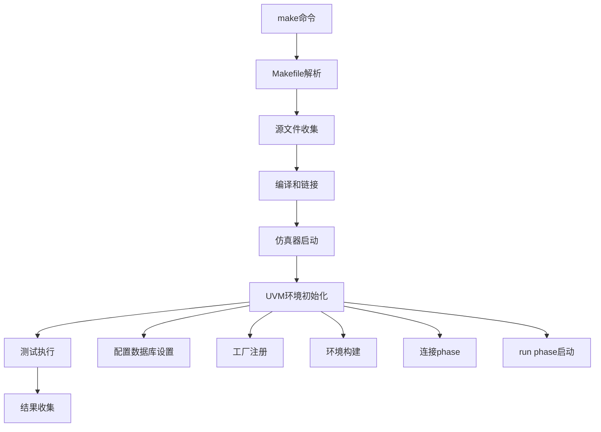
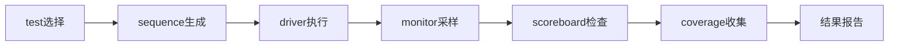
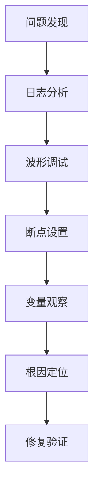

# 核心文件和流程掌握指南

作为UVM验证工程师，深度理解core-v-verif平台的关键文件和流程是项目成功的基础。本指南将按照优先级和学习路径，详细分析您必须掌握的文件、流程和技术细节。

## 🎯 文件掌握优先级矩阵

### 🔴 高优先级文件 (必须精通)

| 文件类别 | 具体文件 | 掌握深度 | 学习时间 |
|---------|---------|----------|----------|
| **构建系统** | `mk/uvmt/uvmt.mk` | 精通 | 2-3天 |
| **UVM环境** | `cv32e40p/tb/uvmt/uvmt_cv32e40p_tb.sv` | 精通 | 3-4天 |
| **DUT集成** | `cv32e40p/tb/uvmt/uvmt_cv32e40p_dut_wrap.sv` | 精通 | 2-3天 |
| **测试基类** | `cv32e40p/tests/uvmt/uvmt_cv32e40p_test_cfg.sv` | 精通 | 2-3天 |
| **配置管理** | `cv32e40p/sim/ExternalRepos.mk` | 熟悉 | 1-2天 |

### 🟡 中优先级文件 (需要理解)

| 文件类别 | 具体文件 | 掌握深度 | 学习时间 |
|---------|---------|----------|----------|
| **UVM组件** | `cv32e40p/env/uvme_cv32e40p/` | 理解 | 3-5天 |
| **接口定义** | `cv32e40p/tb/uvmt/uvmt_cv32e40p_interfaces.sv` | 理解 | 1-2天 |
| **序列库** | `cv32e40p/tests/uvmt/base-tests/` | 理解 | 2-3天 |
| **覆盖率模型** | Coverage相关文件 | 理解 | 2-3天 |

### 🟢 低优先级文件 (了解即可)

| 文件类别 | 具体文件 | 掌握深度 | 学习时间 |
|---------|---------|----------|----------|
| **工具配置** | 各种tool-specific配置 | 了解 | 按需学习 |
| **文档和脚本** | 辅助脚本和文档 | 了解 | 按需学习 |

## 📁 核心文件详细分析

### 🏗️ 1. 构建系统核心：`mk/uvmt/uvmt.mk`

**为什么是最重要的文件？**
- 控制整个验证环境的编译和运行
- 定义工具链、编译选项、仿真参数
- 是理解验证流程的入口点

**必须掌握的内容：**

```makefile
# 关键变量理解
SIMULATOR        # 仿真器选择 (vcs, questa, xcelium)
WAVES           # 波形生成控制
COV             # 覆盖率收集控制
USE_ISS         # 指令集仿真器集成

# 关键目标理解
comp            # 编译目标的详细流程
sim             # 仿真目标的参数传递
clean           # 清理和重置机制
```

**深度学习要点：**
1. **编译流程分析**
   ```bash
   # 理解完整的编译链条
   源文件收集 → 预处理 → 编译 → 链接 → 仿真准备
   ```

2. **参数传递机制**
   ```makefile
   # 从命令行到仿真器的参数传递路径
   make参数 → Makefile变量 → 仿真器选项 → UVM环境配置
   ```

3. **工具集成方式**
   - 不同仿真器的适配机制
   - 覆盖率工具的集成方式
   - 调试工具的配置方法

### 🧪 2. UVM环境顶层：`uvmt_cv32e40p_tb.sv`

**核心作用：**
- UVM测试环境的顶层模块
- 连接RTL DUT和UVM环境
- 管理时钟、复位和接口

**必须理解的结构：**

```systemverilog
// 关键组件连接
uvmt_cv32e40p_dut_wrap dut_wrap();  // DUT包装器
uvme_cv32e40p_env_c env;            // UVM环境
uvmt_cv32e40p_cfg_c cfg;            // 配置对象

// 接口实例和连接
uvma_clknrst_if     clknrst_if();   // 时钟复位接口
uvma_interrupt_if   interrupt_if(); // 中断接口
uvma_debug_if       debug_if();     // 调试接口
```

**深度分析要点：**
1. **接口层次结构**
   ```
   TB顶层
   ├── 时钟和复位管理
   ├── 主要功能接口
   │   ├── 指令内存接口
   │   ├── 数据内存接口
   │   └── 调试接口
   └── 辅助和监控接口
       ├── 中断接口
       └── 跟踪接口
   ```

2. **初始化和配置流程**
   ```systemverilog
   initial begin
     // 配置数据库设置
     uvm_config_db#(virtual uvma_*)::set();
     // 环境启动
     run_test();
   end
   ```

### 🔌 3. DUT包装器：`uvmt_cv32e40p_dut_wrap.sv`

**关键职责：**
- 封装RTL核心的复杂接口
- 提供统一的验证接口
- 处理信号转换和协议适配

**重点掌握内容：**

```systemverilog
// RTL实例化
cv32e40p_top #(
  .COREV_PULP(COREV_PULP),
  .COREV_CLUSTER(COREV_CLUSTER)
) dut (
  // 信号连接...
);

// 接口适配逻辑
assign instr_req_o    = instr_if.req;
assign instr_addr_o   = instr_if.addr;
assign data_req_o     = data_if.req;
```

**深入理解要点：**
1. **参数传递机制**
   - RTL参数的UVM配置方式
   - 编译时参数vs运行时配置

2. **信号映射策略**
   - UVM接口到RTL信号的映射
   - 时钟域和复位策略
   - 协议转换逻辑

### 🎛️ 4. 测试配置：`uvmt_cv32e40p_test_cfg.sv`

**核心功能：**
- 定义测试的基础配置
- 管理验证环境的参数
- 提供测试定制接口

**关键配置参数：**

```systemverilog
class uvmt_cv32e40p_cfg_c extends uvm_object;
  // 核心配置
  bit                     enabled;
  bit                     is_active;
  bit                     trn_log_enabled;

  // 覆盖率配置
  bit                     cov_model_enabled;
  bit                     scoreboard_enabled;

  // 调试和跟踪
  bit                     debug_enabled;
  bit                     trace_enabled;
endclass
```

## 🔄 核心验证流程深度解析

### 📋 流程1：验证环境启动流程



**每个阶段的关键点：**

1. **编译阶段**
   ```bash
   # 重要的编译检查点
   ├── 文件列表生成是否正确
   ├── 预处理宏定义是否生效
   ├── 接口绑定是否成功
   └── UVM库链接是否正确
   ```

2. **UVM初始化阶段**
   ```systemverilog
   // 关键的初始化检查
   ├── uvm_config_db设置验证
   ├── 虚拟接口传递检查
   ├── 工厂覆盖确认
   └── 环境层次结构验证
   ```

### 📋 流程2：测试执行流程



**每个组件的深度理解：**

1. **Sequence层次**
   ```systemverilog
   // sequence的组织结构
   virtual sequence
   ├── instruction sequences
   ├── interrupt sequences
   ├── debug sequences
   └── error injection sequences
   ```

2. **Agent结构**
   ```systemverilog
   // 典型的agent组成
   uvma_* agent
   ├── sequencer (激励生成控制)
   ├── driver (信号驱动)
   ├── monitor (信号监控)
   └── coverage collector (覆盖率收集)
   ```

### 📋 流程3：调试和分析流程



## 🔧 关键配置文件掌握

### 🛠️ ExternalRepos.mk 深度理解

**文件作用：**
- 管理外部RTL代码的获取
- 控制版本和分支选择
- 配置构建依赖

**关键配置变量：**

```makefile
# RTL源码控制
CV32E40P_REPO    = https://github.com/openhwgroup/cv32e40p
CV32E40P_BRANCH  = master
CV32E40P_HASH    = 特定的commit hash

# 依赖库控制
RISCVDV_REPO     = https://github.com/google/riscv-dv
RISCVDV_BRANCH   = master
```

**版本管理最佳实践：**
1. **稳定性优先**：使用具体的commit hash而非分支名
2. **依赖追踪**：记录所有外部依赖的版本信息
3. **兼容性验证**：新版本集成前的充分测试

### 🧬 UVM环境配置文件

**配置层次结构：**
```
配置管理
├── 全局配置 (uvmt_cv32e40p_cfg_c)
├── 环境配置 (uvme_cv32e40p_cfg_c)
├── Agent配置 (uvma_*_cfg_c)
└── 组件配置 (具体driver/monitor配置)
```

## 📊 文件学习策略和时间安排

### 🚀 第一周：基础文件掌握
```
Day 1-2: uvmt.mk深度学习
├── 完整阅读和理解
├── 关键变量和目标分析
└── 实际运行和参数测试

Day 3-4: testbench顶层分析
├── 接口连接理解
├── 初始化流程跟踪
└── 配置机制分析

Day 5-6: DUT包装器分析
├── RTL接口映射
├── 信号转换逻辑
└── 参数传递机制

Day 7: 配置文件整合
├── 配置类层次结构
├── 参数传递链条
└── 测试定制方法
```

### 🔬 第二周：深度流程理解
```
Day 1-3: UVM环境组件
├── env/agent结构分析
├── sequence层次理解
└── 覆盖率模型学习

Day 4-5: 编译和仿真流程
├── 完整流程跟踪
├── 工具集成机制
└── 参数传递验证

Day 6-7: 调试和优化
├── 调试流程实践
├── 性能优化技巧
└── 问题定位方法
```

## 💡 掌握验证技巧

### 🔍 文件学习的有效方法

1. **渐进式理解法**
   ```
   第一遍：整体结构扫描
   第二遍：关键部分精读
   第三遍：细节深入和实践
   第四遍：问题导向的针对性学习
   ```

2. **实践验证法**
   ```bash
   # 通过修改验证理解
   1. 修改简单参数观察影响
   2. 添加调试信息跟踪流程
   3. 复制文件进行安全实验
   4. 对比不同配置的行为差异
   ```

3. **文档结合法**
   - 结合注释理解设计意图
   - 参考相关文档验证理解
   - 查看git历史了解演进过程

### 🎯 关键理解检查点

**理解质量自评：**

- [ ] 能够独立修改Makefile实现新的编译目标
- [ ] 能够在testbench中添加新的接口和连接
- [ ] 能够修改DUT包装器适配新的RTL接口
- [ ] 能够创建新的测试配置和参数组合
- [ ] 能够跟踪和调试完整的验证流程
- [ ] 能够解释每个配置参数的作用和影响

---

**下一步：** 继续学习 [CV32E40P深度参考分析](03-cv32e40p-reference.md)，深入理解现有验证环境的实现细节和可复用组件。