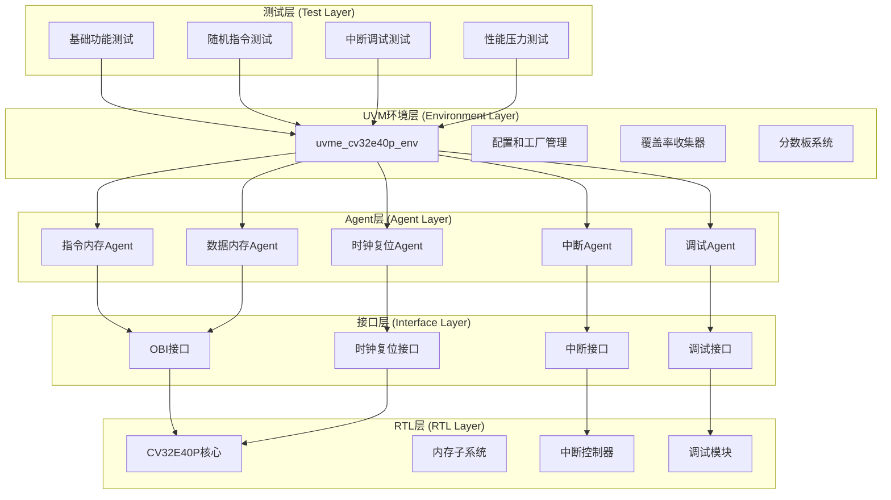

# CV32E40P验证环境深度参考分析

CV32E40P验证环境是core-v-verif平台上最成熟和完整的验证实现，为新RISC-V核心验证提供了宝贵的参考模板。本文档深度剖析其架构、组件和实现细节，帮助您快速理解和复用关键技术。

## 🏗️ 验证环境整体架构分析

### 架构层次图


### 🎯 架构设计原则

**1. 模块化和可复用性**
```systemverilog
// 每个主要功能都有独立的agent
uvma_obi_agent        // OBI总线协议agent (高复用价值)
uvma_interrupt_agent  // 中断处理agent (中等复用价值)
uvma_debug_agent      // 调试接口agent (高复用价值)
uvma_clknrst_agent    // 时钟复位agent (高复用价值)
```

**2. 配置驱动的灵活性**
```systemverilog
// 统一的配置管理
uvme_cv32e40p_cfg_c 环境配置
├── uvma_obi_cfg_c 总线配置
├── uvma_interrupt_cfg_c 中断配置
├── uvma_debug_cfg_c 调试配置
└── 覆盖率和分数板配置
```

**3. 标准化的验证流程**
```systemverilog
// 标准的UVM phase流程
build_phase()    → 组件构建和配置
connect_phase()  → 组件连接和接口绑定
run_phase()      → 测试执行和监控
```

## 🧬 可复用组件详细分析

### 🚌 1. OBI Agent (超高复用价值 95%)

**位置：** `lib/uvma_obi/`

**核心价值：**
- OpenHW Group标准的OBI协议实现
- 高度参数化和可配置
- 支持多种总线模式和性能配置

**关键组件结构：**
```systemverilog
uvma_obi_agent_c
├── uvma_obi_cfg_c           // 配置类
├── uvma_obi_cntxt_c         // 上下文类
├── uvma_obi_sqr_c           // 序列器
├── uvma_obi_drv_c           // 驱动器
├── uvma_obi_mon_c           // 监控器
├── uvma_obi_seq_item_c      // 事务类
└── uvma_obi_cov_model_c     // 覆盖率模型
```

**复用适配要点：**
```systemverilog
// 关键参数适配
parameter int unsigned ADDR_WIDTH = 32;  // 地址宽度
parameter int unsigned DATA_WIDTH = 32;  // 数据宽度
parameter int unsigned ID_WIDTH   = 4;   // ID宽度

// 协议特性配置
cfg.drv_mode = UVMA_OBI_DRV_MODE_ACTIVE;
cfg.mon_mode = UVMA_OBI_MON_MODE_ACTIVE;
cfg.supports_unaligned = 1'b1;
```

**新核心适配策略：**
1. **保持接口兼容**：如果新核心使用OBI协议，可直接复用
2. **参数调整**：根据新核心规格调整地址、数据宽度
3. **协议扩展**：添加新核心特有的协议特性

### ⚡ 2. 中断Agent (中等复用价值 70%)

**位置：** `lib/uvma_interrupt/`

**核心特点：**
- 支持标准RISC-V中断模型
- 可配置的中断优先级和嵌套
- 灵活的中断注入和控制

**关键接口定义：**
```systemverilog
interface uvma_interrupt_if();
  logic [31:0] irq;           // 中断信号
  logic        nmi;           // 不可屏蔽中断
  logic [4:0]  irq_id;        // 中断ID
  logic [7:0]  irq_level;     // 中断级别
endinterface
```

**复用考虑因素：**
- 新核心的中断架构兼容性
- 中断数量和类型的差异
- 优先级处理机制的不同

### 🔧 3. 调试Agent (高复用价值 85%)

**位置：** `lib/uvma_debug/`

**标准化优势：**
- 基于RISC-V调试规范1.0
- 标准的调试协议实现
- 支持断点、单步、寄存器访问

**接口标准化：**
```systemverilog
interface uvma_debug_if();
  logic        debug_req_i;    // 调试请求
  logic        debug_havereset_o;
  logic        debug_running_o;
  logic        debug_halted_o;
endinterface
```

**高复用原因：**
- RISC-V调试标准的通用性
- 接口定义的标准化
- 实现的成熟度和稳定性

### 🕰️ 4. 时钟复位Agent (超高复用价值 98%)

**位置：** `lib/uvma_clknrst/`

**通用性极强：**
- 所有数字设计的基础需求
- 高度参数化的实现
- 支持多种时钟和复位模式

**配置灵活性：**
```systemverilog
uvma_clknrst_cfg_c cfg;
cfg.freq_mhz = 100;           // 时钟频率
cfg.reset_polarity = 0;       // 复位极性
cfg.reset_async = 1;          // 异步复位
cfg.startup_timeout = 1000;   // 启动超时
```

## 🎯 环境层组件分析

### 🌍 1. 环境主类：`uvme_cv32e40p_env_c`

**位置：** `cv32e40p/env/uvme_cv32e40p/uvme_cv32e40p_env.sv`

**核心职责：**
- 管理所有agent和子组件
- 配置验证环境的行为
- 协调各组件间的交互

**组件组织结构：**
```systemverilog
class uvme_cv32e40p_env_c extends uvm_env;
  // Agent实例
  uvma_clknrst_agent_c     clknrst_agent;
  uvma_obi_agent_c         instr_obi_agent;
  uvma_obi_agent_c         data_obi_agent;
  uvma_interrupt_agent_c   interrupt_agent;
  uvma_debug_agent_c       debug_agent;

  // 环境组件
  uvme_cv32e40p_cfg_c      cfg;
  uvme_cv32e40p_cntxt_c    cntxt;
  uvme_cv32e40p_sb_c       sb;           // 分数板
  uvme_cv32e40p_cov_model_c cov_model;  // 覆盖率模型
endclass
```

**复用指导：**
1. **保持组件结构**：agent组织方式高度可复用
2. **适配接口数量**：根据新核心调整agent实例数量
3. **扩展专用功能**：添加新核心特有的验证组件

### 📊 2. 分数板系统：`uvme_cv32e40p_sb_c`

**位置：** `cv32e40p/env/uvme_cv32e40p/uvme_cv32e40p_sb.sv`

**验证策略：**
- 指令级精确对比验证
- 基于Imperas参考模型
- 实时的执行结果检查

**关键实现机制：**
```systemverilog
// 参考模型集成
uvma_rvfi_agent_c rvfi_agent;          // RVFI接口agent
uvma_isacov_agent_c isacov_agent;      // ISA覆盖率agent

// 对比验证流程
function void compare_transactions();
  // RTL执行结果 vs 参考模型结果
  if (rtl_result != ref_model_result) begin
    `uvm_error("SB", "Instruction execution mismatch")
  end
endfunction
```

**复用适配策略：**
1. **保持验证原理**：指令级对比验证策略通用
2. **适配ISA差异**：根据新核心的ISA配置参考模型
3. **扩展专用指令**：添加新核心特有指令的验证

### 📈 3. 覆盖率模型：`uvme_cv32e40p_cov_model_c`

**覆盖率层次结构：**
```systemverilog
// 指令覆盖率
covergroup instr_cg;
  cp_opcode: coverpoint instr.opcode;
  cp_funct3: coverpoint instr.funct3;
  cp_funct7: coverpoint instr.funct7;
  // 交叉覆盖率
  cross_opcode_funct: cross cp_opcode, cp_funct3;
endgroup

// 系统状态覆盖率
covergroup sys_state_cg;
  cp_priv_mode: coverpoint current_priv_mode;
  cp_interrupt_pending: coverpoint interrupt_pending;
  cp_debug_mode: coverpoint debug_mode_active;
endgroup
```

**复用价值分析：**
- **基础ISA覆盖率**：RV32I部分直接复用 (90%)
- **扩展指令覆盖率**：需要根据新核心调整 (40%)
- **系统级覆盖率**：RISC-V通用部分可复用 (80%)

## 🧪 测试开发框架分析

### 📝 1. 测试基类体系

**基类层次结构：**
```systemverilog
uvmt_cv32e40p_base_test_c                    // 基础测试类
├── uvmt_cv32e40p_firmware_test_c            // 固件测试基类
├── uvmt_cv32e40p_random_test_c              // 随机测试基类
├── uvmt_cv32e40p_debug_test_c               // 调试测试基类
└── uvmt_cv32e40p_interrupt_test_c           // 中断测试基类
```

**基类功能分析：**

```systemverilog
// 基础测试类的核心功能
class uvmt_cv32e40p_base_test_c extends uvm_test;
  // 环境和配置
  uvme_cv32e40p_env_c env;
  uvmt_cv32e40p_cfg_c test_cfg;

  // 通用配置方法
  virtual function void configure_env();
    // 环境基础配置
    env.cfg.enabled = 1;
    env.cfg.scoreboard_enabled = 1;
    env.cfg.cov_model_enabled = 1;
  endfunction

  // 通用的测试流程
  virtual task run_phase(uvm_phase phase);
    phase.raise_objection(this);
    configure_env();
    start_sequences();
    wait_for_completion();
    phase.drop_objection(this);
  endtask
endclass
```

**复用策略：**
1. **保持基类结构**：测试组织方式高度通用
2. **适配配置参数**：调整新核心相关的配置
3. **扩展测试类型**：添加新核心特有的测试类别

### 🎲 2. 序列库设计

**序列组织结构：**
```
序列库
├── 基础指令序列
│   ├── ALU指令序列
│   ├── 分支跳转序列
│   ├── 内存访问序列
│   └── CSR操作序列
├── 复合功能序列
│   ├── 中断处理序列
│   ├── 调试操作序列
│   ├── 异常处理序列
│   └── 上下文切换序列
└── 压力测试序列
    ├── 随机指令混合
    ├── 高频中断注入
    ├── 内存压力测试
    └── 边界条件测试
```

**关键序列实现模式：**

```systemverilog
// 通用的指令序列基类
class uvme_cv32e40p_base_seq_c extends uvm_sequence;
  // 公共配置和上下文
  uvme_cv32e40p_cfg_c cfg;
  uvme_cv32e40p_cntxt_c cntxt;

  // 通用的约束
  constraint reasonable_length_c {
    length inside {[10:100]};
  }

  // 可复用的辅助方法
  virtual function void setup_sequence();
    // 序列初始化逻辑
  endfunction
endclass

// 具体的ALU指令序列
class uvme_cv32e40p_alu_seq_c extends uvme_cv32e40p_base_seq_c;
  rand bit [31:0] operand_a, operand_b;
  rand alu_op_e   operation;

  constraint valid_operation_c {
    operation inside {ADD, SUB, XOR, OR, AND};
  }
endclass
```

## 🔧 配置和参数化分析

### ⚙️ 1. 配置类层次结构

```systemverilog
// 配置类的完整层次
uvmt_cv32e40p_cfg_c (测试级配置)
├── uvme_cv32e40p_cfg_c (环境级配置)
│   ├── uvma_clknrst_cfg_c (时钟复位配置)
│   ├── uvma_obi_cfg_c (OBI接口配置)
│   ├── uvma_interrupt_cfg_c (中断配置)
│   ├── uvma_debug_cfg_c (调试配置)
│   └── 覆盖率和分数板配置
└── 测试特定配置参数
```

**配置参数化示例：**

```systemverilog
class uvme_cv32e40p_cfg_c extends uvm_object;
  // 核心特性配置
  bit                     corev_pulp_enable;
  bit                     corev_cluster_enable;
  bit [31:0]              boot_addr;
  bit [31:0]              mtvec_addr;

  // 验证环境配置
  bit                     scoreboard_enabled;
  bit                     cov_model_enabled;
  bit                     trn_log_enabled;

  // 性能和调试配置
  int unsigned            max_instr_count;
  int unsigned            timeout_cycles;
  uvma_debug_cfg_c        debug_cfg;
endclass
```

### 🎛️ 2. 参数传递机制

**从测试到RTL的参数流：**
```
命令行参数 → Makefile变量 → UVM配置 → RTL参数
     ↓              ↓           ↓         ↓
make COREV_PULP=1 → +define... → cfg.* → DUT.*
```

**实际参数传递示例：**
```systemverilog
// 在测试中设置参数
initial begin
  uvm_config_db#(bit)::set(null, "*", "COREV_PULP", 1);
  uvm_config_db#(bit)::set(null, "*", "COREV_CLUSTER", 0);
end

// 在DUT包装器中使用
`ifdef COREV_PULP
  .COREV_PULP(1),
`else
  .COREV_PULP(0),
`endif
```

## 📊 最佳实践提取

### 🎯 1. 验证方法学最佳实践

**分层验证策略：**
1. **单元级验证**：每个agent独立验证
2. **集成级验证**：agent间交互验证
3. **系统级验证**：端到端功能验证
4. **压力级验证**：极限条件和性能验证

**覆盖率驱动验证：**
```systemverilog
// 覆盖率目标设定
功能覆盖率目标: 95%+
代码覆盖率目标: 90%+
断言覆盖率目标: 100%

// 覆盖率收集策略
- 实时覆盖率监控
- 覆盖率差距分析
- 目标导向的测试生成
```

### 🔧 2. 开发效率最佳实践

**代码复用策略：**
- 最大化利用lib/中的通用组件
- 标准化的接口和协议
- 参数化的组件设计

**调试友好设计：**
```systemverilog
// 丰富的调试信息
`uvm_info("TEST", $sformatf("Config: PULP=%0d, CLUSTER=%0d",
                           COREV_PULP, COREV_CLUSTER), UVM_LOW)

// 分层的日志控制
uvm_top.env.set_report_verbosity_level_hier(UVM_HIGH);
```

**自动化和工具化：**
- 自动化的回归测试
- 覆盖率自动收集和报告
- 波形和日志的自动分析

## 📈 复用价值评估矩阵

| 组件类别 | 直接复用 | 参数适配 | 重新开发 | 推荐策略 |
|---------|----------|----------|----------|----------|
| **OBI Agent** | 95% | 5% | 0% | 直接复用+参数调整 |
| **时钟复位Agent** | 98% | 2% | 0% | 直接复用 |
| **调试Agent** | 85% | 10% | 5% | 复用+接口适配 |
| **中断Agent** | 70% | 20% | 10% | 复用+功能扩展 |
| **测试基类** | 90% | 8% | 2% | 复用+配置调整 |
| **序列库** | 60% | 30% | 10% | 选择复用+新增 |
| **覆盖率模型** | 70% | 25% | 5% | 复用+扩展 |
| **分数板** | 80% | 15% | 5% | 复用+ISA适配 |

---

**下一步：** 学习 [新核心移植详细指南](04-new-core-porting-guide.md)，了解如何将CV32E40P验证环境的成功经验应用到新的RISC-V核心验证项目中。