# 新核心验证环境移植详细指南

本指南提供从CV32E40P验证环境到新RISC-V核心的完整移植流程，以CVA6为例说明具体操作步骤。遵循本指南，您可以系统性地建立高质量的验证环境。

## 🎯 移植项目规划

### 项目阶段划分

```mermaid
gantt
    title 新核心验证环境移植时间线
    dateFormat  X
    axisFormat %d

    section 准备阶段
    需求分析    :1, 3
    架构对比    :2, 5
    工具准备    :3, 6

    section 基础搭建
    目录创建    :6, 8
    RTL集成     :7, 12
    基础编译    :10, 15

    section 环境移植
    接口适配    :15, 22
    Agent复用   :18, 25
    配置迁移    :20, 27

    section 测试开发
    基础测试    :25, 35
    功能验证    :30, 45
    回归建立    :40, 50

    section 优化完善
    性能调优    :45, 55
    覆盖率优化  :50, 60
    文档完善    :55, 60
```


### 里程碑和检查点
| 阶段 | 里程碑 | 成功标准 | 预计时间 |
|------|--------|----------|----------|
| **阶段1** | 基础环境搭建 | hello-world测试通过 | 1-2周 |
| **阶段2** | 核心功能验证 | 基础ISA测试通过 | 2-3周 |
| **阶段3** | 高级功能集成 | 中断/调试功能正常 | 1-2周 |
| **阶段4** | 覆盖率达成 | 功能覆盖率>90% | 2-3周 |

## 📋 Phase 1: 需求分析和架构对比

### Step 1.1: 新核心规格分析

**创建分析文档模板：**
```bash
# 在项目根目录创建规格分析目录
mkdir -p docs/core-analysis
cd docs/core-analysis

# 创建规格对比文档
cat > core-specification-analysis.md << 'EOF'
# 核心规格对比分析

## 基础架构对比
| 特性 | CV32E40P | 新核心 (如CVA6) | 影响评估 |
|------|----------|-----------------|----------|
| 架构位宽 | 32位 | 64位 | 高 - 需要适配所有宽度相关逻辑 |
| ISA支持 | RV32IMC + Xpulp | RV64IMAC | 中 - 基础ISA可复用 |
| 特权模式 | Machine | Machine + User | 高 - 需要扩展特权验证 |
| 中断控制 | CLINT | CLINT + PLIC | 中 - 需要扩展中断agent |
| 调试接口 | 标准RISC-V | 标准RISC-V | 低 - 可直接复用 |
| 内存接口 | OBI | AXI/OBI | 高 - 可能需要新的agent |

## 接口差异分析
...
EOF
```

**深度技术分析清单：**
```bash
# 核心技术分析检查清单
□ ISA扩展指令对比
□ CSR寄存器映射分析
□ 中断/异常处理机制
□ 内存管理单元差异
□ 调试接口兼容性
□ 性能计数器支持
□ 自定义指令扩展
□ 时钟域和复位策略
```

### Step 1.2: 验证环境差距分析

**创建差距分析脚本：**
```bash
#!/bin/bash
# gap-analysis.sh - 自动分析验证环境差距

NEW_CORE_NAME="cva6"  # 替换为您的新核心名称

echo "=== 验证环境差距分析 ==="

# 分析现有CV32E40P组件
echo "1. 现有组件复用性分析:"
find cv32e40p/env -name "*.sv" | while read file; do
    echo "  分析文件: $file"
    # 检查是否包含CV32E40P特定的硬编码
    grep -l "cv32e40p\|CV32E40P" "$file" && echo "    需要适配"
done

# 分析lib组件复用性
echo "2. 通用库组件分析:"
ls -la lib/uvma_*/
echo "  → 这些组件通常可以直接复用或轻微修改"

# 分析需要新增的组件
echo "3. 需要新增的验证组件:"
echo "  □ ${NEW_CORE_NAME}特定的DUT包装器"
echo "  □ ${NEW_CORE_NAME}相关的配置类"
echo "  □ ${NEW_CORE_NAME}专用的测试用例"
echo "  □ 新核心的覆盖率模型"
```

## 📁 Phase 2: 目录结构和基础搭建

### Step 2.1: 创建新核心目录结构

**目录创建脚本：**
```bash
#!/bin/bash
# create-new-core-structure.sh

NEW_CORE="cva6"  # 替换为您的核心名称

echo "创建 ${NEW_CORE} 验证环境目录结构..."

# 创建主目录结构
mkdir -p ${NEW_CORE}/{env,sim,tb,tests,docs,bsp}

# 创建env子目录 (UVM环境)
mkdir -p ${NEW_CORE}/env/{uvme_${NEW_CORE},corev-dv}

# 创建sim子目录 (仿真环境)
mkdir -p ${NEW_CORE}/sim/{uvmt,core,tools}

# 创建tb子目录 (测试平台)
mkdir -p ${NEW_CORE}/tb/{uvmt,core}

# 创建tests子目录 (测试用例)
mkdir -p ${NEW_CORE}/tests/{uvmt,core,programs}

# 创建docs子目录 (文档)
mkdir -p ${NEW_CORE}/docs/{VerifPlans,learning-center}

echo "目录结构创建完成:"
tree ${NEW_CORE}
```

### Step 2.2: 初始配置文件创建

**创建ExternalRepos.mk：**
```makefile
# ${NEW_CORE}/sim/ExternalRepos.mk
# 新核心的外部仓库配置

# 核心RTL仓库配置
${NEW_CORE^^}_REPO     ?= https://github.com/openhwgroup/${NEW_CORE}
${NEW_CORE^^}_BRANCH   ?= master
${NEW_CORE^^}_HASH     ?= HEAD
${NEW_CORE^^}_TAG      ?=

# 其他依赖库 (复用CV32E40P的配置)
include $(CORE_V_VERIF)/cv32e40p/sim/ExternalRepos.mk

# 新核心特定的依赖
RISCV_TESTS_REPO   ?= https://github.com/riscv/riscv-tests
RISCV_TESTS_BRANCH ?= master

# 克隆规则
clone_${NEW_CORE}_rtl:
	$(CLONE_CMD) $(${NEW_CORE^^}_REPO) $(${NEW_CORE^^}_BRANCH) \
	             $(CORE_V_VERIF)/core-v-cores/${NEW_CORE} $(${NEW_CORE^^}_HASH)

.PHONY: clone_${NEW_CORE}_rtl
```

**创建基础Makefile：**
```makefile
# ${NEW_CORE}/sim/uvmt/Makefile
# 新核心的基础Makefile

# 继承通用配置
include $(CORE_V_VERIF)/mk/uvmt/uvmt.mk

# 新核心特定配置
export NEW_CORE_NAME = ${NEW_CORE}
export DUT_TOP       = ${NEW_CORE}_top

# RTL文件列表
RTL_SOURCES += $(CORE_V_VERIF)/core-v-cores/${NEW_CORE}/rtl/**/*.sv

# 测试程序路径
TEST_PROGRAM_PATH = $(CORE_V_VERIF)/${NEW_CORE}/tests/programs

# 基础目标
hello-world:
	$(MAKE) test TEST=hello-world

# 调试目标
debug:
	$(MAKE) test TEST=hello-world WAVES=1

.PHONY: hello-world debug
```

## 🔌 Phase 3: 接口和RTL集成

### Step 3.1: DUT包装器开发

**创建DUT包装器模板：**
```systemverilog
// ${NEW_CORE}/tb/uvmt/uvmt_${NEW_CORE}_dut_wrap.sv

`ifndef __UVMT_${NEW_CORE^^}_DUT_WRAP_SV__
`define __UVMT_${NEW_CORE^^}_DUT_WRAP_SV__

module uvmt_${NEW_CORE}_dut_wrap
  import ${NEW_CORE}_pkg::*;
(
  // 时钟和复位接口
  uvma_clknrst_if    clknrst_if,

  // 内存接口 (根据新核心的接口类型选择)
  uvma_obi_if        instr_obi_if,    // 如果使用OBI
  uvma_axi_if        instr_axi_if,    // 如果使用AXI
  uvma_obi_if        data_obi_if,

  // 中断接口
  uvma_interrupt_if  interrupt_if,

  // 调试接口
  uvma_debug_if      debug_if,

  // 新核心特定接口
  // 根据需要添加其他接口
);

  // RTL实例化
  ${NEW_CORE}_top #(
    // 参数配置 - 根据新核心的参数调整
    .XLEN(64),                    // 如果是64位核心
    .ILEN(32),
    .ASID_WIDTH(1),
    .BOOT_ADDR(32'h1000),
    // 添加其他必要参数...
  ) dut (
    // 时钟和复位连接
    .clk_i    (clknrst_if.clk),
    .rst_ni   (~clknrst_if.reset),

    // 指令内存接口连接
    .instr_req_o    (instr_obi_if.req),
    .instr_gnt_i    (instr_obi_if.gnt),
    .instr_addr_o   (instr_obi_if.addr),
    .instr_rdata_i  (instr_obi_if.rdata),
    .instr_rvalid_i (instr_obi_if.rvalid),

    // 数据内存接口连接
    .data_req_o     (data_obi_if.req),
    .data_gnt_i     (data_obi_if.gnt),
    .data_we_o      (data_obi_if.we),
    .data_addr_o    (data_obi_if.addr),
    .data_wdata_o   (data_obi_if.wdata),
    .data_be_o      (data_obi_if.be),
    .data_rdata_i   (data_obi_if.rdata),
    .data_rvalid_i  (data_obi_if.rvalid),

    // 中断连接
    .irq_i          (interrupt_if.irq),

    // 调试接口连接
    .debug_req_i    (debug_if.debug_req_i),
    .debug_havereset_o (debug_if.debug_havereset_o),
    .debug_running_o   (debug_if.debug_running_o),
    .debug_halted_o    (debug_if.debug_halted_o)

    // 根据新核心添加其他信号连接...
  );

  // 接口适配逻辑 (如果需要)
  // 例如：协议转换、位宽适配等

endmodule

`endif // __UVMT_${NEW_CORE^^}_DUT_WRAP_SV__
```

### Step 3.2: 接口适配策略

**接口兼容性分析脚本：**
```python
#!/usr/bin/env python3
# interface-compatibility-check.py

def analyze_interface_compatibility(cv32e40p_interfaces, new_core_interfaces):
    """分析接口兼容性并生成适配建议"""

    compatibility_matrix = {
        'clknrst': {'compatibility': 'high', 'effort': 'low'},
        'obi': {'compatibility': 'medium', 'effort': 'medium'},
        'axi': {'compatibility': 'low', 'effort': 'high'},
        'interrupt': {'compatibility': 'high', 'effort': 'low'},
        'debug': {'compatibility': 'high', 'effort': 'low'}
    }

    adaptation_strategies = {
        'direct_reuse': "直接复用CV32E40P的接口agent",
        'parameter_adapt': "调整参数后复用agent",
        'protocol_bridge': "需要开发协议桥接逻辑",
        'new_development': "需要开发全新的agent"
    }

    print("=== 接口适配策略分析 ===")
    for interface, details in compatibility_matrix.items():
        print(f"接口: {interface}")
        print(f"  兼容性: {details['compatibility']}")
        print(f"  工作量: {details['effort']}")

        # 根据兼容性推荐策略
        if details['compatibility'] == 'high':
            strategy = 'direct_reuse'
        elif details['compatibility'] == 'medium':
            strategy = 'parameter_adapt'
        else:
            strategy = 'new_development'

        print(f"  推荐策略: {adaptation_strategies[strategy]}")
        print()

if __name__ == "__main__":
    analyze_interface_compatibility([], [])
```

## 🌍 Phase 4: UVM环境移植

### Step 4.1: 环境配置类创建

**创建配置基类：**
```systemverilog
// ${NEW_CORE}/env/uvme_${NEW_CORE}/uvme_${NEW_CORE}_cfg.sv

class uvme_${NEW_CORE}_cfg_c extends uvm_object;

  // 基础配置 (复用CV32E40P的模式)
  bit                    enabled        = 1;
  bit                    is_active      = 1;
  bit                    cov_model_enabled = 1;
  bit                    trn_log_enabled   = 0;

  // 新核心特定配置
  bit                    is_64bit       = 1;  // 如果是64位核心
  bit [63:0]             boot_addr      = 64'h1000;
  bit [63:0]             mtvec_addr     = 64'h1004;

  // Agent配置 (复用CV32E40P的agent配置)
  uvma_clknrst_cfg_c     clknrst_cfg;
  uvma_obi_cfg_c         instr_obi_cfg;
  uvma_obi_cfg_c         data_obi_cfg;
  uvma_interrupt_cfg_c   interrupt_cfg;
  uvma_debug_cfg_c       debug_cfg;

  // 新核心可能需要的新agent配置
  // uvma_axi_cfg_c      axi_cfg;  // 如果使用AXI接口

  `uvm_object_utils_begin(uvme_${NEW_CORE}_cfg_c)
    `uvm_field_int(enabled, UVM_DEFAULT)
    `uvm_field_int(is_active, UVM_DEFAULT)
    `uvm_field_int(is_64bit, UVM_DEFAULT)
    `uvm_field_int(boot_addr, UVM_DEFAULT)
    // 添加其他字段...
  `uvm_object_utils_end

  function new(string name = "uvme_${NEW_CORE}_cfg");
    super.new(name);

    // 创建子配置对象
    clknrst_cfg   = uvma_clknrst_cfg_c::type_id::create("clknrst_cfg");
    instr_obi_cfg = uvma_obi_cfg_c::type_id::create("instr_obi_cfg");
    data_obi_cfg  = uvma_obi_cfg_c::type_id::create("data_obi_cfg");
    interrupt_cfg = uvma_interrupt_cfg_c::type_id::create("interrupt_cfg");
    debug_cfg     = uvma_debug_cfg_c::type_id::create("debug_cfg");

    // 配置初始化
    configure_agents();
  endfunction

  virtual function void configure_agents();
    // 时钟复位配置 (通用，可直接复用)
    clknrst_cfg.enabled    = enabled;
    clknrst_cfg.is_active  = is_active;
    clknrst_cfg.freq_mhz   = 100;

    // OBI配置适配 (可能需要调整数据宽度)
    instr_obi_cfg.enabled   = enabled;
    instr_obi_cfg.is_active = is_active;
    instr_obi_cfg.addr_width = is_64bit ? 64 : 32;
    instr_obi_cfg.data_width = 32;  // 指令通常是32位

    data_obi_cfg.enabled   = enabled;
    data_obi_cfg.is_active = is_active;
    data_obi_cfg.addr_width = is_64bit ? 64 : 32;
    data_obi_cfg.data_width = is_64bit ? 64 : 32;

    // 中断配置 (可能需要扩展)
    interrupt_cfg.enabled   = enabled;
    interrupt_cfg.is_active = is_active;

    // 调试配置 (通常可直接复用)
    debug_cfg.enabled   = enabled;
    debug_cfg.is_active = is_active;
  endfunction

endclass
```

### Step 4.2: 环境主类开发

**创建环境主类模板：**
```systemverilog
// ${NEW_CORE}/env/uvme_${NEW_CORE}/uvme_${NEW_CORE}_env.sv

class uvme_${NEW_CORE}_env_c extends uvm_env;

  // 配置和上下文
  uvme_${NEW_CORE}_cfg_c    cfg;
  uvme_${NEW_CORE}_cntxt_c  cntxt;

  // Agent实例 (复用CV32E40P的agent)
  uvma_clknrst_agent_c      clknrst_agent;
  uvma_obi_agent_c          instr_obi_agent;
  uvma_obi_agent_c          data_obi_agent;
  uvma_interrupt_agent_c    interrupt_agent;
  uvma_debug_agent_c        debug_agent;

  // 环境组件
  uvme_${NEW_CORE}_sb_c         sb;         // 分数板
  uvme_${NEW_CORE}_cov_model_c  cov_model; // 覆盖率模型

  `uvm_component_utils(uvme_${NEW_CORE}_env_c)

  function new(string name = "uvme_${NEW_CORE}_env", uvm_component parent = null);
    super.new(name, parent);
  endfunction

  virtual function void build_phase(uvm_phase phase);
    super.build_phase(phase);

    // 获取配置
    if (!uvm_config_db#(uvme_${NEW_CORE}_cfg_c)::get(this, "", "cfg", cfg)) begin
      `uvm_fatal("CFG", "Configuration object not found")
    end

    // 创建上下文
    cntxt = uvme_${NEW_CORE}_cntxt_c::type_id::create("cntxt");

    // 设置agent配置
    uvm_config_db#(uvma_clknrst_cfg_c)::set(this, "clknrst_agent", "cfg", cfg.clknrst_cfg);
    uvm_config_db#(uvma_obi_cfg_c)::set(this, "instr_obi_agent", "cfg", cfg.instr_obi_cfg);
    uvm_config_db#(uvma_obi_cfg_c)::set(this, "data_obi_agent", "cfg", cfg.data_obi_cfg);

    // 创建agent (直接复用CV32E40P的agent)
    if (cfg.clknrst_cfg.enabled) begin
      clknrst_agent = uvma_clknrst_agent_c::type_id::create("clknrst_agent", this);
    end

    if (cfg.instr_obi_cfg.enabled) begin
      instr_obi_agent = uvma_obi_agent_c::type_id::create("instr_obi_agent", this);
    end

    if (cfg.data_obi_cfg.enabled) begin
      data_obi_agent = uvma_obi_agent_c::type_id::create("data_obi_agent", this);
    end

    // 创建环境组件
    if (cfg.enabled) begin
      if (cfg.scoreboard_enabled) begin
        sb = uvme_${NEW_CORE}_sb_c::type_id::create("sb", this);
      end

      if (cfg.cov_model_enabled) begin
        cov_model = uvme_${NEW_CORE}_cov_model_c::type_id::create("cov_model", this);
      end
    end
  endfunction

  virtual function void connect_phase(uvm_phase phase);
    super.connect_phase(phase);

    // 连接分数板
    if (sb != null) begin
      // 连接OBI agent的monitor到分数板
      if (instr_obi_agent != null) begin
        instr_obi_agent.mon.ap.connect(sb.instr_obi_fifo.analysis_export);
      end

      if (data_obi_agent != null) begin
        data_obi_agent.mon.ap.connect(sb.data_obi_fifo.analysis_export);
      end
    end

    // 连接覆盖率收集器
    if (cov_model != null) begin
      // 添加覆盖率连接...
    end
  endfunction

endclass
```

## 🧪 Phase 5: 测试开发和验证

### Step 5.1: 基础测试类开发

**创建测试基类：**
```systemverilog
// ${NEW_CORE}/tests/uvmt/uvmt_${NEW_CORE}_base_test.sv

class uvmt_${NEW_CORE}_base_test_c extends uvm_test;

  // 环境和配置
  uvme_${NEW_CORE}_env_c     env;
  uvmt_${NEW_CORE}_cfg_c     test_cfg;

  `uvm_component_utils(uvmt_${NEW_CORE}_base_test_c)

  function new(string name = "uvmt_${NEW_CORE}_base_test", uvm_component parent = null);
    super.new(name, parent);
  endfunction

  virtual function void build_phase(uvm_phase phase);
    super.build_phase(phase);

    // 创建测试配置 (复用CV32E40P的配置模式)
    test_cfg = uvmt_${NEW_CORE}_cfg_c::type_id::create("test_cfg");
    configure_test();

    // 创建环境
    env = uvme_${NEW_CORE}_env_c::type_id::create("env", this);

    // 设置环境配置
    uvm_config_db#(uvme_${NEW_CORE}_cfg_c)::set(this, "env", "cfg", test_cfg.env_cfg);
  endfunction

  virtual function void configure_test();
    // 基础配置 (参考CV32E40P的配置方式)
    test_cfg.env_cfg.enabled = 1;
    test_cfg.env_cfg.is_active = 1;
    test_cfg.env_cfg.scoreboard_enabled = 1;
    test_cfg.env_cfg.cov_model_enabled = 1;

    // 新核心特定配置
    test_cfg.env_cfg.is_64bit = 1;  // 如果是64位核心
    test_cfg.env_cfg.boot_addr = 64'h1000;

    // 获取命令行参数
    void'($value$plusargs("BOOT_ADDR=%h", test_cfg.env_cfg.boot_addr));
  endfunction

  virtual task run_phase(uvm_phase phase);
    phase.raise_objection(this);

    `uvm_info("TEST", $sformatf("Starting %s", get_name()), UVM_LOW)

    // 等待复位释放
    wait_for_reset_release();

    // 启动测试序列
    start_sequences();

    // 等待测试完成
    wait_for_test_completion();

    `uvm_info("TEST", $sformatf("Completed %s", get_name()), UVM_LOW)

    phase.drop_objection(this);
  endtask

  virtual task wait_for_reset_release();
    // 等待复位释放逻辑
    `uvm_info("TEST", "Waiting for reset release...", UVM_LOW)
    // 实现复位等待逻辑...
  endtask

  virtual task start_sequences();
    // 在子类中实现具体的序列启动逻辑
    `uvm_info("TEST", "Base test - no sequences to start", UVM_LOW)
  endtask

  virtual task wait_for_test_completion();
    // 基础的测试完成等待逻辑
    #10000; // 基础超时时间
  endtask

endclass
```

### Step 5.2: Hello World测试实现

**创建最基础的测试：**
```systemverilog
// ${NEW_CORE}/tests/uvmt/uvmt_${NEW_CORE}_hello_world_test.sv

class uvmt_${NEW_CORE}_hello_world_test_c extends uvmt_${NEW_CORE}_base_test_c;

  `uvm_component_utils(uvmt_${NEW_CORE}_hello_world_test_c)

  function new(string name = "uvmt_${NEW_CORE}_hello_world_test", uvm_component parent = null);
    super.new(name, parent);
  endfunction

  virtual function void configure_test();
    super.configure_test();

    // Hello World特定配置
    test_cfg.env_cfg.trn_log_enabled = 1;  // 启用详细日志

    // 加载简单的测试程序
    test_cfg.test_program = "hello_world";
  endfunction

  virtual task start_sequences();
    uvme_${NEW_CORE}_hello_world_seq_c hello_seq;

    `uvm_info("TEST", "Starting Hello World sequence", UVM_LOW)

    hello_seq = uvme_${NEW_CORE}_hello_world_seq_c::type_id::create("hello_seq");
    hello_seq.start(env.instr_obi_agent.sqr);
  endtask

  virtual task wait_for_test_completion();
    // 等待Hello World程序执行完成
    // 通常通过监控特定的内存地址或信号来判断

    fork
      begin
        // 等待程序正常结束标志
        wait_for_program_completion();
        `uvm_info("TEST", "Hello World completed successfully", UVM_LOW)
      end
      begin
        // 超时保护
        #100000;
        `uvm_error("TEST", "Hello World test timeout")
      end
    join_any

    disable fork;
  endtask

  virtual task wait_for_program_completion();
    // 实现程序完成检测逻辑
    // 例如：监控退出系统调用、特定内存写入等
  endtask

endclass
```

## 🔄 Phase 6: 迭代优化和验证

### Step 6.1: 编译和运行验证

**创建验证脚本：**
```bash
#!/bin/bash
# verify-porting.sh - 移植验证脚本

NEW_CORE="cva6"
TEST_DIR="${NEW_CORE}/sim/uvmt"

echo "=== 新核心验证环境移植验证 ==="

# 阶段1: 编译验证
echo "1. 编译验证..."
cd $TEST_DIR
if make comp; then
    echo "✅ 编译成功"
else
    echo "❌ 编译失败 - 检查语法和依赖"
    exit 1
fi

# 阶段2: Hello World测试
echo "2. Hello World测试..."
if make hello-world; then
    echo "✅ Hello World测试通过"
else
    echo "❌ Hello World测试失败 - 检查RTL集成"
    exit 1
fi

# 阶段3: 基础功能测试
echo "3. 基础功能测试..."
basic_tests=("arithmetic" "branches" "memory")
for test in "${basic_tests[@]}"; do
    echo "  运行测试: $test"
    if make test TEST=$test; then
        echo "  ✅ $test 通过"
    else
        echo "  ❌ $test 失败"
    fi
done

# 阶段4: 覆盖率检查
echo "4. 覆盖率检查..."
if make test TEST=hello-world COV=1; then
    echo "✅ 覆盖率收集成功"
    # 检查覆盖率报告
    if [ -f sim_results/coverage/report.txt ]; then
        echo "覆盖率报告生成成功"
    fi
else
    echo "❌ 覆盖率收集失败"
fi

echo "=== 移植验证完成 ==="
```

### Step 6.2: 性能和调试优化

**创建性能调优配置：**
```makefile
# ${NEW_CORE}/sim/uvmt/Makefile.perf
# 性能优化配置

# 编译优化选项
VLOG_OPTS += +define+UVM_NO_DPI
VLOG_OPTS += +define+UVM_OBJECT_MUST_HAVE_CONSTRUCTOR
VLOG_OPTS += -timescale=1ns/1ps

# 仿真优化选项
VSIM_OPTS += -classdebug
VSIM_OPTS += -msgmode both
VSIM_OPTS += -displaymsgmode both

# 内存优化
VSIM_OPTS += -sv_lib_order_check
VSIM_OPTS += -permsize 512m
VSIM_OPTS += -stacksize 512m

# 波形优化 (仅在需要时启用)
ifdef WAVES
  VSIM_OPTS += -do "log -r /*; run -all"
else
  VSIM_OPTS += -c  # 命令行模式，提高性能
endif

# 覆盖率优化
ifdef COV
  VLOG_OPTS += +cover=bcesfx
  VSIM_OPTS += -coverage
  VSIM_OPTS += -coverstore ${NEW_CORE}_coverage
endif
```

## 📊 移植质量检查清单

### 功能完整性检查
```bash
# 移植质量自检清单
echo "=== 移植质量检查 ==="

# 1. 基础功能检查
□ 编译无错误无警告
□ Hello World测试通过
□ 基础ISA指令测试通过
□ 内存访问功能正常
□ 中断处理功能正常
□ 调试接口功能正常

# 2. 代码质量检查
□ 代码复用率 > 70%
□ 新增代码有完整注释
□ 遵循命名规范
□ 错误处理机制完善

# 3. 性能指标检查
□ 编译时间合理 (< 5分钟)
□ 仿真速度可接受
□ 内存使用合理
□ 无内存泄漏

# 4. 文档完整性检查
□ README文件更新
□ 配置参数文档化
□ 已知问题记录
□ 使用示例提供
```

### 回归测试建立

**创建回归测试套件：**
```bash
#!/bin/bash
# create-regression-suite.sh

NEW_CORE="cva6"
REGRESSION_DIR="${NEW_CORE}/sim/regression"

mkdir -p $REGRESSION_DIR

# 创建回归测试列表
cat > $REGRESSION_DIR/regression_tests.list << 'EOF'
# 基础功能测试
hello_world
basic_arithmetic
memory_operations
branch_instructions

# 系统功能测试
interrupt_handling
debug_operations
csr_operations

# 压力测试
random_instructions
memory_stress
interrupt_stress
EOF

# 创建回归测试脚本
cat > $REGRESSION_DIR/run_regression.sh << 'EOF'
#!/bin/bash

PASSED=0
FAILED=0
FAILED_TESTS=""

while read test_name; do
    if [[ $test_name =~ ^#.* ]] || [[ -z $test_name ]]; then
        continue
    fi

    echo "Running test: $test_name"
    if make test TEST=$test_name; then
        echo "✅ $test_name PASSED"
        ((PASSED++))
    else
        echo "❌ $test_name FAILED"
        ((FAILED++))
        FAILED_TESTS="$FAILED_TESTS $test_name"
    fi
done < regression_tests.list

echo "=== 回归测试总结 ==="
echo "通过: $PASSED"
echo "失败: $FAILED"
if [ $FAILED -gt 0 ]; then
    echo "失败的测试: $FAILED_TESTS"
fi
EOF

chmod +x $REGRESSION_DIR/run_regression.sh
```

## 🎯 移植成功标准

### 最终验收标准

| 类别 | 标准 | 验证方法 |
|------|------|----------|
| **功能正确性** | 所有基础测试通过 | 回归测试 |
| **代码质量** | 复用率>70%, 注释覆盖>80% | 代码审查 |
| **性能指标** | 编译<5min, 仿真速度合理 | 性能测试 |
| **文档完整** | README, 配置文档完整 | 文档审查 |
| **可维护性** | 模块化设计, 清晰的接口 | 架构审查 |

---

**下一步：** 学习 [UVM最佳实践指南](05-uvm-best-practices.md)，掌握在core-v-verif平台上的高效UVM开发方法和技巧。