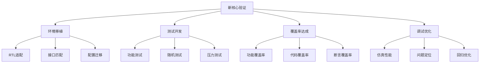

# UVM验证工程师完整指导手册

欢迎来到core-v-verif平台的UVM验证工程师专业指导手册。本指南专为需要在core-v-verif平台上进行新RISC-V核心验证的专业验证工程师设计，特别是那些需要从CV32E40P验证环境迁移到新核心（如CVA6特殊版本）的工程师。

## 🎯 适用人群

**主要目标用户：**
- 有UVM验证经验的专业验证工程师
- 需要在core-v-verif平台进行新核心验证的工程师
- 希望从CV32E40P迁移验证环境到其他RISC-V核心的团队
- 负责建立完整验证流程的项目负责人

**前置要求：**
- UVM方法学基础知识
- SystemVerilog编程经验
- RISC-V架构基本理解
- 验证工程基础经验

## 🗺️ 学习路径导航

### 🔍 第一阶段：深度分析 (1-2周)
1. **[工作职责分析](01-job-analysis.md)** 📋
   - 全面分析新核心验证的工作范围
   - 技能需求gap分析
   - 与CV32E40P验证工作的对比

2. **[核心文件和流程掌握](02-core-files-and-processes.md)** 📚
   - 必须掌握的关键文件清单
   - 核心验证流程深度解析
   - 文件依赖关系和作用机制

### 🔬 第二阶段：参考学习 (2-3周)
3. **[CV32E40P深度参考分析](03-cv32e40p-reference.md)** 🔎
   - CV32E40P验证环境完整剖析
   - 可复用组件识别和分析
   - 验证方法学最佳实践提取

### 🚀 第三阶段：实际实施 (3-4周)
4. **[新核心移植详细指南](04-new-core-porting-guide.md)** 🔄
   - 分步骤的验证环境移植流程
   - 配置文件适配方法
   - 常见移植问题和解决方案

5. **[UVM最佳实践](05-uvm-best-practices.md)** ⭐
   - core-v-verif平台下的UVM开发最佳实践
   - 高效的测试开发模式
   - 覆盖率驱动验证策略

### 🛠️ 第四阶段：专业技能 (持续学习)
6. **[调试和工具使用](06-debugging-and-tools.md)** 🔧
   - 专业调试技巧和方法
   - 工具链深度使用指南
   - 性能优化和问题定位

7. **[实际案例研究](07-case-studies.md)** 📊
   - 真实验证项目案例分析
   - 成功经验和失败教训
   - 行业最佳实践总结

### 📋 快速参考工具
- **[关键文件检查清单](quick-reference/key-files-checklist.md)** ✅
- **[常用工作流程](quick-reference/common-workflows.md)** 🔄
- **[问题诊断和解决](quick-reference/troubleshooting.md)** 🚨

## 🎯 核心工作挑战概览

### 主要技术挑战

### 核心技能要求矩阵

| 技能领域 | 基础要求 | 高级要求 | 专家要求 |
|---------|---------|---------|---------|
| **UVM方法学** | 基础UVM组件 | 高级验证计划 | 自定义UVM架构 |
| **RISC-V架构** | ISA基础 | 特权模式理解 | 微架构优化 |
| **SystemVerilog** | 基础语法 | 高级特性 | 性能优化 |
| **调试技能** | 基础调试 | 复杂问题定位 | 系统性调试方法 |
| **工具使用** | 基础仿真 | 高级分析工具 | 工具链定制 |

## 🔗 平台资源链接

### Core-V-Verif 生态系统
- **[项目主页](../README_ZH.md)** - core-v-verif项目总体介绍
- **[CV32E40P学习中心](../cv32e40p/docs/learning-center/README.md)** - 完整的学习资源
- **[Makefile系统指南](../mk/README_ZH.md)** - 验证环境核心构建系统

### 外部资源
- **[OpenHW Group](https://www.openhwgroup.org)** - 开源硬件组织
- **[RISC-V规范](https://riscv.org/specifications/)** - RISC-V指令集架构规范
- **[UVM用户指南](https://www.accellera.org/downloads/standards/uvm)** - UVM官方文档

## 💡 快速开始建议

### 🏃‍♂️ 急需上手的工程师 (1天快速通道)
1. 直接查看 **[快速参考清单](quick-reference/key-files-checklist.md)**
2. 阅读 **[CV32E40P参考分析](03-cv32e40p-reference.md)** 的核心部分
3. 使用 **[常用工作流程](quick-reference/common-workflows.md)** 开始实际操作

### 🎓 系统学习的工程师 (按序学习)
1. 从 **[工作职责分析](01-job-analysis.md)** 开始全面了解
2. 按照学习路径依次深入学习
3. 结合实际项目需求选择重点章节

### 🔧 有经验的工程师 (选择性学习)
1. 重点关注 **[新核心移植指南](04-new-core-porting-guide.md)**
2. 参考 **[UVM最佳实践](05-uvm-best-practices.md)** 优化现有流程
3. 使用 **[调试工具指南](06-debugging-and-tools.md)** 提升效率

## 📈 成功指标

通过本指南的学习，您应该能够：

✅ **理解并分析**新RISC-V核心的验证需求
✅ **独立搭建**基于core-v-verif的完整验证环境
✅ **高效开发**针对性的UVM测试用例
✅ **系统实施**覆盖率驱动验证策略
✅ **专业解决**验证过程中的复杂问题
✅ **建立优化**的验证工作流程

## 🤝 社区和支持

- **技术问题**：参考各章节的问题解决指南
- **最佳实践分享**：查看案例研究章节
- **工具使用问题**：参考调试和工具使用指南
- **进阶学习**：关注OpenHW Group的最新资源

---

**开始您的专业验证工程师之旅！选择适合您当前需求的学习路径，逐步掌握core-v-verif平台上的高效验证方法学。**

*📝 本指南持续更新，基于实际项目经验和社区反馈不断完善。*