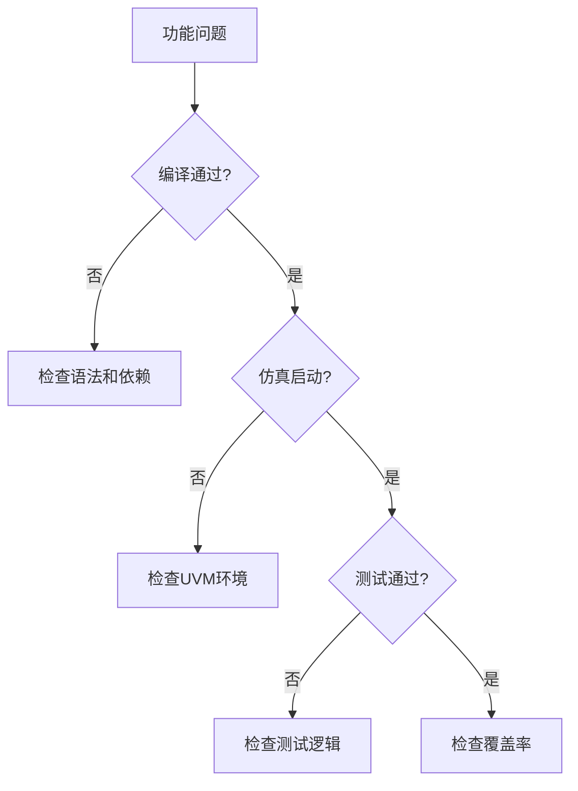

# 问题诊断和解决速查表

## 🚨 常见问题快速诊断

### ⚡ 编译问题

#### ❌ 文件未找到错误
**症状：** `Error: File not found: xxx.sv`

**诊断步骤：**
```bash
# 1. 检查文件是否存在
find . -name "xxx.sv"

# 2. 检查Makefile中的文件路径
grep -r "xxx.sv" mk/

# 3. 检查文件列表
cat mk/uvmt/uvmt.flist
```

**常见解决方案：**
- [ ] 更新文件路径
- [ ] 添加文件到编译列表
- [ ] 检查文件权限

#### ❌ 语法错误
**症状：** `Syntax error at line xxx`

**快速检查：**
```bash
# 检查语法
vlog -lint problematic_file.sv

# 常见语法问题
grep -n "endclass\|endmodule\|endfunction\|endtask" file.sv
```

**常见问题：**
- [ ] 缺少分号
- [ ] 括号不匹配
- [ ] 关键字拼写错误
- [ ] 缺少endclass/endmodule

#### ❌ 包依赖问题
**症状：** `Undefined identifier: xxx`

**检查包导入：**
```systemverilog
// 确保正确导入包
import uvm_pkg::*;
import uvme_cv32e40p_pkg::*;

// 检查包声明顺序
`include "uvm_macros.svh"
`include "uvme_cv32e40p_macros.svh"
```

---

### 🔧 仿真运行问题

#### ❌ UVM Phase错误
**症状：** `UVM_FATAL: Build phase failed`

**诊断命令：**
```bash
# 启用详细日志
make test TEST=hello_world UVM_VERBOSITY=UVM_HIGH

# 查看phase信息
grep -i "phase\|build\|connect" transcript
```

**常见原因和解决：**
```systemverilog
// 1. 配置对象未找到
if (!uvm_config_db#(cfg_type)::get(this, "", "cfg", cfg)) begin
  `uvm_fatal("CFG", "Configuration not found")
end

// 2. 接口未正确传递
uvm_config_db#(virtual interface_type)::set(null, "*", "vif", vif);

// 3. 组件创建失败
if (component == null) begin
  component = component_type::type_id::create("component", this);
end
```

#### ❌ 序列启动失败
**症状：** `Sequence start failed` 或序列不执行

**诊断步骤：**
```systemverilog
// 1. 检查sequencer是否存在
if (sequencer == null) begin
  `uvm_error("SEQ", "Sequencer is null")
end

// 2. 检查sequence注册
my_seq_c::type_id::set_type_override(base_seq_c::get_type());

// 3. 检查sequence启动
virtual task start_sequences();
  my_seq = my_seq_c::type_id::create("my_seq");
  my_seq.start(env.agent.sequencer);
endtask
```

#### ❌ 接口连接问题
**症状：** 接口信号无变化或连接错误

**检查接口绑定：**
```systemverilog
// 1. 确认接口实例化
uvma_obi_if obi_if();

// 2. 确认DUT连接
assign dut.req_o = obi_if.req;
assign obi_if.gnt = dut.gnt_i;

// 3. 确认UVM接口传递
uvm_config_db#(virtual uvma_obi_if)::set(null, "*obi_agent*", "vif", obi_if);
```

---

### 📊 覆盖率问题

#### ❌ 覆盖率为0或不收集
**症状：** 覆盖率报告显示0%

**诊断步骤：**
```bash
# 1. 检查覆盖率编译选项
grep -i "cover" mk/uvmt/uvmt.mk

# 2. 检查覆盖率使能
make test TEST=hello_world COV=1 UVM_VERBOSITY=UVM_HIGH

# 3. 检查覆盖率实例化
grep -i "covergroup\|sample" transcript
```

**解决方案：**
```systemverilog
// 1. 确保覆盖率实例化
covergroup my_cg;
  option.per_instance = 1;
  // 覆盖点定义
endgroup

function new();
  super.new();
  my_cg = new();
endfunction

// 2. 确保覆盖率采样
function void sample_coverage();
  my_cg.sample();
endfunction
```

#### ❌ 覆盖率不增长
**症状：** 覆盖率始终在低值

**检查采样条件：**
```systemverilog
// 1. 检查覆盖点定义
coverpoint signal {
  bins valid[] = {[0:15]};
  bins invalid = default;
}

// 2. 检查采样时机
always @(posedge clk) begin
  if (valid_condition) begin
    cov_model.sample();
  end
end

// 3. 检查bin定义
// 确保bin覆盖所有期望的值
```

---

### 🌊 波形调试问题

#### ❌ 波形未生成
**症状：** 找不到波形文件

**检查步骤：**
```bash
# 1. 检查WAVES选项
make test TEST=hello_world WAVES=1

# 2. 检查波形文件位置
find . -name "*.vcd" -o -name "*.wlf" -o -name "*.fsdb"

# 3. 检查仿真器配置
grep -i "wave\|dump" mk/uvmt/uvmt.mk
```

#### ❌ 信号未显示
**症状：** 波形中缺少关键信号

**添加信号到波形：**
```systemverilog
// 在testbench中添加
initial begin
  $dumpfile("waves.vcd");
  $dumpvars(0, tb_top);
end

// 或使用仿真器特定命令
// For Questa: $wlfdumpvars();
// For VCS: $vcdplusfile("waves.vpd");
```

---

### 🔄 性能问题

#### ❌ 编译时间过长
**症状：** 编译超过10分钟

**优化方案：**
```bash
# 1. 并行编译
make comp -j8

# 2. 增量编译
export INCREMENTAL_COMPILE=1

# 3. 减少编译范围
# 注释掉不需要的包和文件

# 4. 使用更快的编译选项
export FAST_COMPILE=1
```

#### ❌ 仿真速度慢
**症状：** 仿真运行超过预期时间

**加速技巧：**
```bash
# 1. 关闭不必要的调试
make test TEST=my_test UVM_VERBOSITY=UVM_NONE

# 2. 减少波形记录
# 只记录关键信号

# 3. 使用优化编译
export OPTIMIZE=1

# 4. 调整仿真器选项
export SIM_OPTS="+ntb_random_seed=1 -sv_seed=1"
```

---

## 🔍 系统性调试方法

### 📋 问题分类和诊断流程

#### 🎯 1. 功能问题诊断


#### 🔧 2. 环境问题诊断
```bash
# 环境问题检查清单
□ 工具版本兼容性
□ 环境变量设置
□ 路径和权限
□ 依赖库完整性
```

### 🛠️ 调试工具使用

#### 📊 1. 日志分析工具
```bash
# 错误日志提取
grep -i "error\|fatal\|fail" transcript > errors.log

# 警告分析
grep -i "warning" transcript | sort | uniq -c

# 时间分析
grep "@" transcript | head -20

# UVM phase分析
grep -i "phase" transcript | grep -E "build|connect|run"
```

#### 🌊 2. 波形分析技巧
```bash
# Questa/ModelSim 波形分析
vsim -view waves.wlf
# 在波形查看器中：
# - 添加关键信号
# - 设置触发条件
# - 使用光标测量时间

# VCS 波形分析
verdi -ssf waves.fsdb
# 在Verdi中：
# - 使用nTrace查看信号
# - 设置断点和触发
# - 分析信号相关性
```

---

## 💡 预防性最佳实践

### ✅ 编码最佳实践
```systemverilog
// 1. 始终检查空指针
if (obj != null) begin
  obj.method();
end

// 2. 使用try-catch处理异常
try begin
  risky_operation();
end
catch begin
  `uvm_error("CATCH", "Operation failed")
end

// 3. 添加详细的调试信息
`uvm_info("DEBUG", $sformatf("State: %s, Value: %0d", state, value), UVM_HIGH)

// 4. 使用断言验证假设
assert (condition) else
  `uvm_error("ASSERT", "Condition not met")
```

### 🔧 环境配置最佳实践
```bash
# 1. 版本锁定
# 在ExternalRepos.mk中使用具体的commit hash

# 2. 自动化检查
# 创建环境检查脚本
./scripts/check_environment.sh

# 3. 文档化配置
# 记录所有环境依赖和设置

# 4. 定期清理
make clean
rm -rf work/ sim_results/
```

---

## 📞 获取帮助的方法

### 🔍 1. 自助调试资源
- **日志分析**：仔细阅读完整的错误信息
- **波形调试**：使用波形查看器分析时序
- **代码审查**：逐行检查相关代码
- **文档查询**：查阅UVM和工具文档

### 🤝 2. 团队协作调试
- **问题描述**：清晰描述问题现象和重现步骤
- **环境信息**：提供详细的环境和配置信息
- **最小复现**：创建最小的问题复现案例
- **日志共享**：提供相关的日志和波形文件

### 📚 3. 外部资源
- **官方文档**：UVM官方手册和教程
- **社区论坛**：验证相关的技术论坛
- **厂商支持**：EDA工具厂商的技术支持
- **开源社区**：OpenHW Group和RISC-V社区

---

**🎯 记住：系统性的调试方法比随机尝试更有效！**