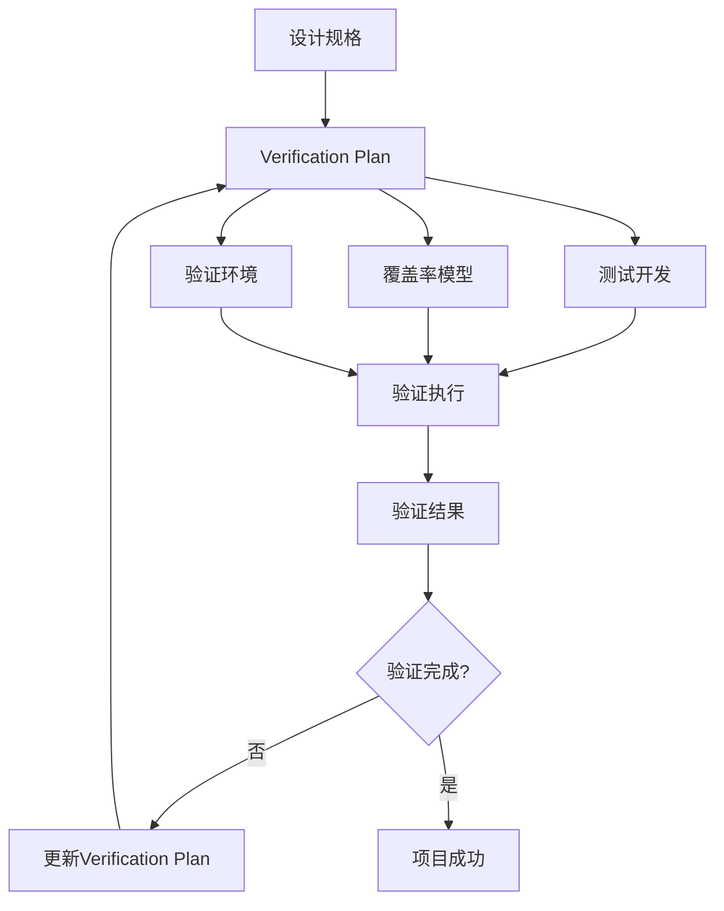
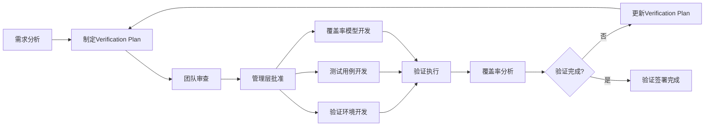

# Verification Plan基础概念和工程价值

## 🎯 什么是Verification Plan？

Verification Plan（验证计划），也被称为Test Plan或DV Plan，是定义**需要验证什么**的核心文档。在RISC-V验证项目中，它是连接设计规格和验证实施的关键桥梁。

### 核心定义
> "Verification Plan是验证项目可能产生的**最有价值的成果**。它不仅定义验证目标，更是整个验证团队的行动指南和成功标准。"
>
> —— 基于CV32E40P项目的成功实践总结

### 📊 Verification Plan的核心作用



## 🏗️ Verification Plan的工程价值

### 1. 项目管理价值 📋
- **明确范围界定**：精确定义什么需要验证，什么不需要验证
- **资源规划依据**：为人力、时间、工具资源分配提供定量依据
- **进度追踪基准**：提供可量化的项目进度和完成度指标
- **风险识别工具**：早期识别验证复杂度和潜在风险点

### 2. 技术实施价值 🔧
- **测试开发指南**：指导UVM环境、测试用例、随机测试的开发方向
- **覆盖率模型基础**：为功能覆盖率、代码覆盖率设计提供依据
- **质量标准定义**：建立Pass/Fail标准和验证完成的判定准则
- **团队协作基础**：统一团队对验证目标和方法的理解

### 3. 商业决策价值 💼
- **投资决策支持**：为管理层提供验证投入的合理性分析
- **市场时间保证**：通过系统规划确保验证不成为项目瓶颈
- **质量风险控制**：通过完整性分析降低产品质量风险
- **合规性证明**：为安全关键应用提供验证完整性证据

## 🎯 CV32E40P项目中的成功实践

### 验证计划驱动的项目流程
基于CV32E40P项目的实际经验，verification plan在验证工程中扮演**核心驱动角色**：



### 量化的项目价值
根据CV32E40P项目经验：

| 价值维度 | 没有Verification Plan | 有完整Verification Plan | 提升幅度 |
|----------|---------------------|----------------------|----------|
| **项目规划准确性** | ~60% | >90% | +50% |
| **测试开发效率** | 基准 | +40% | 显著提升 |
| **缺陷发现率** | 基准 | +35% | 显著提升 |
| **项目按时交付** | ~70% | >95% | +25% |
| **团队沟通效率** | 基准 | +60% | 显著提升 |

## 📋 Verification Plan的核心组成要素

### 1. 功能分解 (Feature Breakdown)
将复杂的处理器功能系统性地分解为可验证的单元：

```
CV32E40P功能分解示例：
├── 基础指令集 (RV32I)
│   ├── 算术逻辑指令
│   ├── 分支跳转指令
│   ├── 内存访问指令
│   └── 系统调用指令
├── 标准扩展指令
│   ├── 乘除法扩展 (RV32M)
│   └── 压缩指令扩展 (RV32C)
├── 系统级功能
│   ├── 中断处理系统
│   ├── 调试接口
│   └── CSR寄存器
├── 微架构特性
│   ├── 流水线行为
│   ├── OBI总线接口
│   └── 睡眠模式
└── 专用扩展
    ├── Xpulp指令扩展
    └── 性能计数器
```

### 2. 验证目标 (Verification Goals)
为每个功能明确定义**需要验证什么**：

**示例 - RV32I ADDI指令的验证目标：**
- ✅ 正确的算术运算结果 (rd = rs1 + imm)
- ✅ 溢出检测和处理
- ✅ 寄存器x0的特殊处理
- ✅ 程序计数器的正确更新
- ✅ 无意外的副作用

### 3. 成功标准 (Pass/Fail Criteria)
定义**如何判断验证通过**：

**CV32E40P采用的4种主要标准：**
1. **自检测试 (Self-Checking)** - 测试程序包含预期结果
2. **签名检查 (Signature Check)** - 基于计算签名的验证
3. **参考模型对比 (Check against RM)** - 与Imperas模型对比
4. **断言检查 (Assertion Check)** - 基于SVA断言的验证

### 4. 覆盖率策略 (Coverage Method)
定义**如何度量验证完整性**：

**CV32E40P的覆盖率层次：**
- **功能覆盖率 (Functional Coverage)** - 基于SystemVerilog covergroup
- **代码覆盖率 (Code Coverage)** - 行覆盖、分支覆盖、条件覆盖
- **断言覆盖率 (Assertion Coverage)** - SVA断言的覆盖情况
- **测试用例覆盖率 (Testcase Coverage)** - 测试用例的执行情况

## 🎯 Verification Plan vs 其他验证活动

### 与Verification Strategy的关系
```mermaid
graph TD
    A[Verification Plan<br/>定义"验证什么"] --> B[Verification Strategy<br/>定义"如何验证"]
    B --> C[UVM环境开发<br/>构建验证平台]
    B --> D[测试用例开发<br/>实现具体测试]
    B --> E[覆盖率实现<br/>量化验证完整性]
```

**关键区别：**
- **Verification Plan** 专注于 **"WHAT"** - 需要验证的功能和目标
- **Verification Strategy** 专注于 **"HOW"** - 验证的方法和实现

### 与Test Case的关系
- **Verification Plan** = 验证需求的**规格说明书**
- **Test Case** = 验证需求的**具体实现**

一个verification plan条目可能对应多个test case，一个test case也可能覆盖多个verification plan条目。

## 📊 Verification Plan的质量标准

### 高质量Verification Plan的特征
1. **完整性 (Completeness)** - 覆盖所有需要验证的功能
2. **可测性 (Testability)** - 每个条目都是可验证的
3. **可追溯性 (Traceability)** - 每个条目都能追溯到设计需求
4. **可度量性 (Measurability)** - 有明确的覆盖率度量方法
5. **一致性 (Consistency)** - 术语和格式的统一性

### 质量评估标准
根据CV32E40P项目经验，质量evaluation维度：

| 质量维度 | 优秀 (>90%) | 良好 (70-90%) | 需改进 (<70%) |
|----------|-------------|---------------|---------------|
| **需求覆盖度** | 100%覆盖所有需求 | 大部分需求覆盖 | 重要需求遗漏 |
| **验证目标明确性** | 目标清晰具体 | 目标基本明确 | 目标模糊不清 |
| **成功标准可操作性** | 标准明确可执行 | 标准基本可行 | 标准难以执行 |
| **覆盖率模型设计** | 系统性覆盖率设计 | 基础覆盖率设计 | 覆盖率设计不足 |

## 🚀 Verification Plan的投资回报

### 短期投资
- **时间投入**：通常需要1-2周制定初版，1-2周审查完善
- **人力投入**：验证工程师30-40%的时间在项目初期
- **管理投入**：需要跨团队的协作和多轮审查

### 长期回报
- **开发效率**：后续验证开发效率提升30-50%
- **质量保证**：缺陷发现率和修复效率显著提升
- **项目可控性**：项目风险和进度的可预测性大幅改善
- **知识积累**：为后续项目提供可复用的经验和模板

## 💡 最佳实践原则

### 1. 早期介入原则
- 在设计规格确定后**立即**开始verification plan制定
- 与设计团队**并行工作**，而不是等待设计完成
- 通过verification plan的制定过程**发现和澄清设计需求**

### 2. 迭代优化原则
- Verification plan不是一次性文档，需要**持续更新**
- 根据验证执行过程中的发现**动态调整**
- 定期review和**版本管理**

### 3. 团队协作原则
- **跨功能团队**共同制定和审查
- **充分沟通**确保理解一致
- **文档化决策**过程和理由

### 4. 可执行性原则
- 每个验证条目都必须是**可实现的**
- 考虑验证环境的**能力限制**
- 平衡**完整性和可行性**

---

**下一步：** 学习 [Excel模板深度解析](02-excel-template-deep-dive.md)，掌握CORE-V项目标准化的verification plan制定工具和方法。