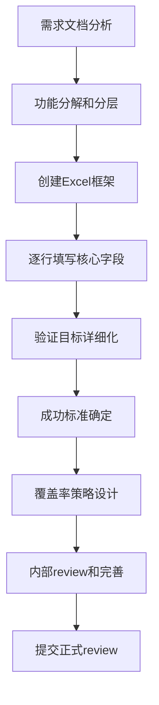
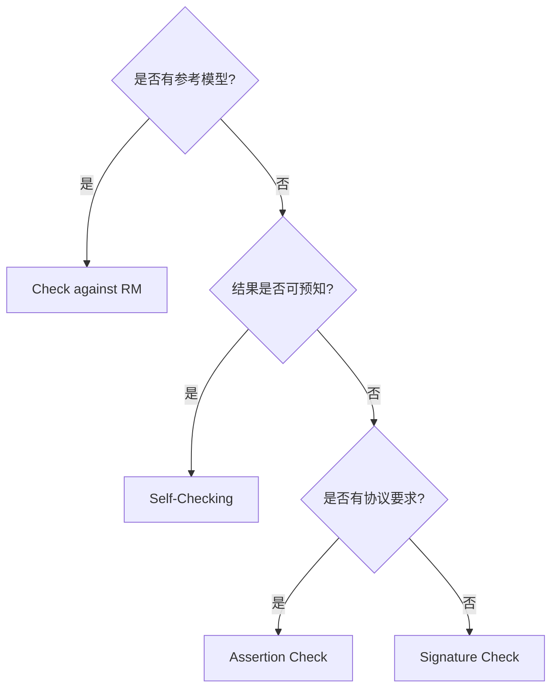

# Excel模板深度解析和使用指南

本章详细解析CORE-V项目的标准Excel模板，这是每个验证工程师必须掌握的核心工具。基于CV32E40P项目的18个实际Excel文档经验，提供最实用的使用指导。

## 📊 CORE-V Excel模板体系概览

### 模板文件结构
```
docs/VerifPlans/templates/
├── CORE-V_Simulation_VerifPlan_Template.xlsx    # 仿真验证计划模板
└── CORE-V_Formal_VerifPlan_Template.xlsx        # 形式化验证计划模板
```

**本章重点：** `CORE-V_Simulation_VerifPlan_Template.xlsx` - 这是验证工程师日常工作的核心工具。

### 为什么使用Excel模板？

**CV32E40P项目选择Excel的原因：**
1. **标准化** - 统一的格式确保所有verification plan的一致性
2. **协作性** - 支持多人编辑和版本控制
3. **可读性** - 表格形式便于review和理解
4. **工具兼容** - 支持Microsoft Excel和LibreOffice Calc
5. **可追溯性** - 便于状态管理和历史记录

## 📋 Excel模板详细字段解析

### 核心字段结构概览

根据`VerificationPlanning101.md`的官方说明，每个Excel模板包含以下核心字段：

| 字段名称 | 用途 | 重要性 | 填写难度 |
|----------|------|--------|----------|
| **Requirement Location** | 需求来源追溯 | ⭐⭐⭐⭐⭐ | 中等 |
| **Feature** | 高层功能描述 | ⭐⭐⭐⭐⭐ | 简单 |
| **Sub-Feature** | 功能细分 | ⭐⭐⭐⭐ | 简单 |
| **Feature Description** | 功能详细描述 | ⭐⭐⭐⭐ | 中等 |
| **Verification Goals** | 验证目标 | ⭐⭐⭐⭐⭐ | 困难 |
| **Pass/Fail Criteria** | 成功标准 | ⭐⭐⭐⭐⭐ | 困难 |
| **Test Type** | 测试类型 | ⭐⭐⭐⭐ | 中等 |
| **Coverage Method** | 覆盖率方法 | ⭐⭐⭐⭐⭐ | 中等 |
| **Link to Coverage** | 覆盖率链接 | ⭐⭐⭐ | 简单 |

## 🎯 逐字段深度解析和填写指南

### 1. Requirement Location (需求来源) ⭐⭐⭐⭐⭐

**作用：** 建立验证条目与设计需求的可追溯链接

**填写要求：**
- **必须**包含具体的文档名称
- **必须**包含章节或页码信息
- **推荐**包含版本号（特别是动态文档）

**CV32E40P实际示例：**
```
好的示例：
✅ "RISC-V Instruction Set Manual Volume I: User-Level ISA, Version 20191213, Section 2.4"
✅ "CV32E40P User Manual v1.3.2, Chapter 3.1 - Pipeline Overview"

不好的示例：
❌ "RISC-V Spec"  (太模糊)
❌ "User Manual"   (没有版本和章节)
❌ "Internal discussion"  (不是正式需求)
```

**填写技巧：**
- 创建一个**需求文档清单**，统一引用格式
- 对于频繁引用的文档，建立**缩写对照表**
- 定期检查文档版本更新，保持**追溯链的有效性**

### 2. Feature (功能) ⭐⭐⭐⭐⭐

**作用：** 定义要验证的高层功能模块

**填写原则：**
- 使用**清晰的功能名称**，避免技术术语过度复杂
- **与设计文档的章节结构对应**
- 保持**适当的抽象层次**（不要过于细节化）

**CV32E40P分层示例：**
```
Level 1 - 顶层功能：
├── RV32I Base Integer Instructions
├── RV32M Multiply/Divide Extension
├── RV32C Compressed Instructions
├── Interrupt Controller
├── Debug Interface
└── OBI Memory Interface

Level 2 - 子功能：
RV32I Base Integer Instructions
├── Register-Immediate Instructions
├── Register-Register Instructions
├── Load/Store Instructions
├── Branch Instructions
└── Jump Instructions
```

**命名规范建议：**
```
推荐格式：
✅ "RV32I Register-Immediate Instructions"
✅ "CLINT Timer Interrupt Handling"
✅ "OBI Memory Interface Protocol"

避免格式：
❌ "Instructions"  (过于宽泛)
❌ "ADDI/SLTI/ANDI/ORI/XORI/LUI/AUIPC"  (过于具体)
```

### 3. Sub-Feature (子功能) ⭐⭐⭐⭐

**作用：** 进一步分解功能到可管理的验证单元

**使用场景：**
- 当Feature过于复杂时，需要进一步分解
- 当不同子功能需要不同的验证策略时
- 当子功能由不同的人负责验证时

**CV32E40P实际分解示例：**
```
Feature: RV32I Register-Immediate Instructions
├── Sub-Feature: ADDI (Add Immediate)
├── Sub-Feature: SLTI (Set Less Than Immediate)
├── Sub-Feature: SLTIU (Set Less Than Immediate Unsigned)
├── Sub-Feature: ANDI (AND Immediate)
├── Sub-Feature: ORI (OR Immediate)
├── Sub-Feature: XORI (XOR Immediate)
├── Sub-Feature: LUI (Load Upper Immediate)
└── Sub-Feature: AUIPC (Add Upper Immediate to PC)
```

**分解原则：**
- **功能独立性** - 每个子功能应该相对独立
- **验证独立性** - 每个子功能应该可以独立验证
- **合理粒度** - 不要过度分解，也不要过于粗糙

### 4. Feature Description (功能描述) ⭐⭐⭐⭐

**作用：** 提供功能的简洁而准确的描述

**写作要求：**
- **简洁性** - 通常1-3句话
- **准确性** - 与设计规格一致
- **完整性** - 覆盖关键行为和特性

**CV32E40P优秀描述示例：**
```
Feature: ADDI Instruction
Description: "Add immediate instruction performs addition of a 12-bit
sign-extended immediate value to the source register rs1 and stores
the result in destination register rd. Arithmetic overflow is ignored."

Feature: CLINT Timer Interrupt
Description: "Core Local Interruptor (CLINT) generates timer interrupts
when the memory-mapped mtime register equals or exceeds the mtime_cmp
register value. Timer interrupts are maskable via MIE.MTIE bit."
```

**写作技巧：**
- **避免简单复制粘贴**设计文档
- **突出验证相关的行为特征**
- **使用主动语态和简洁句式**
- **包含关键的边界条件和特殊情况**

### 5. Verification Goals (验证目标) ⭐⭐⭐⭐⭐

**作用：** 定义具体需要验证的方面，这是最重要的字段之一

**CV32E40P ADDI指令的完整验证目标示例：**
```
Verification Goals for ADDI:
• Correct arithmetic result: rd = rs1 + sign_extended(imm)
• Overflow detection and handling (overflow ignored per RISC-V spec)
• Underflow detection and handling (underflow ignored per RISC-V spec)
• Register x0 handling: result discarded when rd = x0
• Program counter increment: PC = PC + 4 after execution
• No unintended side effects: other registers unchanged
• All register combinations: rs1 = x0..x31, rd = x0..x31
• Immediate value coverage: all 12-bit immediate patterns
• Pipeline behavior: correct instruction flow and stalls
```

**制定技巧：**
1. **从需求出发** - 每个goal都应该对应具体的设计需求
2. **考虑边界情况** - 包含极值、特殊值、边界条件
3. **包含错误情况** - 非法操作、异常情况的处理
4. **考虑交互影响** - 与其他功能的交互和依赖关系

### 6. Pass/Fail Criteria (成功标准) ⭐⭐⭐⭐⭐

**作用：** 定义如何判断验证是否通过

**CV32E40P使用的4种主要标准：**

#### 6.1 Self-Checking (自检测试)
```
适用场景：
✅ 简单的功能验证
✅ 符合性测试
✅ 已知结果的测试

示例：
"Test program includes expected results and compares DUT output
against known-good values using assertion statements."
```

#### 6.2 Signature Check (签名检查)
```
适用场景：
✅ 复杂的计算验证
✅ RISC-V compliance tests
✅ 结果较复杂的测试

示例：
"Test calculates signature based on instruction execution results
and compares against golden signature from reference implementation."
```

#### 6.3 Check against RM (参考模型对比)
```
适用场景：
✅ 指令级验证 (推荐方式)
✅ 系统级行为验证
✅ 复杂交互验证

示例：
"DUT instruction execution results compared cycle-by-cycle against
Imperas RISC-V reference model using RVFI interface."
```

#### 6.4 Assertion Check (断言检查)
```
适用场景：
✅ 接口协议验证
✅ 时序要求验证
✅ 不变性检查

示例：
"SVA assertions monitor OBI bus protocol compliance including
request/grant handshake timing and data validity windows."
```

**选择策略：**
- **优先级**：Check against RM > Self-Checking > Assertion Check > Signature Check
- **组合使用**：复杂功能可以使用多种标准
- **可执行性**：确保所选标准在当前验证环境中可实现

### 7. Test Type (测试类型) ⭐⭐⭐⭐

**CV32E40P使用的测试类型分类：**

#### 7.1 RISC-V Compliance
```
特点：
• 来自RISC-V Foundation的标准测试
• 自检测，包含预期结果
• 主要验证ISA符合性

使用场景：
✅ 基础指令集验证
✅ 标准扩展验证
✅ 符合性认证
```

#### 7.2 Directed Self-Checking
```
特点：
• OpenHW Group开发的定向测试
• 包含预期结果检查
• 针对特定功能或场景

使用场景：
✅ 特定功能深度验证
✅ 边界条件测试
✅ 错误情况验证
```

#### 7.3 Directed Non-Self-Checking
```
特点：
• 定向测试但不包含预期结果
• 依赖参考模型或断言检查
• 更灵活的测试设计

使用场景：
✅ 复杂交互验证
✅ 性能相关验证
✅ 系统级验证
```

#### 7.4 Constrained-Random
```
特点：
• 使用随机指令生成器
• 高覆盖率潜力
• 不可能自检测

使用场景：
✅ 大规模指令序列验证
✅ 边界情况发现
✅ 长时间压力测试
```

### 8. Coverage Method (覆盖率方法) ⭐⭐⭐⭐⭐

**CV32E40P的覆盖率策略层次：**

#### 8.1 Functional Coverage (功能覆盖率) - 推荐方式
```systemverilog
// CV32E40P功能覆盖率示例
covergroup addi_cg;
  cp_rs1: coverpoint rs1_reg {
    bins zero = {0};
    bins low[] = {[1:15]};
    bins high[] = {[16:31]};
  }

  cp_imm: coverpoint immediate {
    bins pos_small[] = {[0:255]};
    bins pos_large[] = {[256:2047]};
    bins neg_small[] = {[-255:-1]};
    bins neg_large[] = {[-2048:-256]};
  }

  cross_rs1_imm: cross cp_rs1, cp_imm;
endgroup
```

**优点：**
- ✅ 直接反映验证目标的达成情况
- ✅ 可以设计复杂的交叉覆盖率
- ✅ 易于理解和review

#### 8.2 Code Coverage (代码覆盖率)
```
包含类型：
• Line Coverage - 代码行覆盖率
• Branch Coverage - 分支覆盖率
• Condition Coverage - 条件覆盖率
• Toggle Coverage - 信号翻转覆盖率

使用场景：
✅ 补充功能覆盖率的不足
✅ 发现遗漏的验证场景
✅ RTL质量评估
```

#### 8.3 Assertion Coverage (断言覆盖率)
```systemverilog
// CV32E40P断言覆盖率示例
property obi_req_gnt_handshake;
  @(posedge clk) disable iff (!rst_n)
    req |-> ##[1:10] gnt;
endproperty

assert property (obi_req_gnt_handshake);
cover property (obi_req_gnt_handshake);
```

#### 8.4 Testcase Coverage
```
定义：
测试用例的执行覆盖率

度量方法：
• 计划测试用例数 vs 执行测试用例数
• 通过测试用例数 vs 总测试用例数
• 不同类型测试的分布情况
```

## 🎯 Excel填写的实战技巧

### 1. 高效填写工作流程



### 2. 协作编辑最佳实践

**版本控制策略：**
```
命名规范：
Feature_VerifPlan_v1.0_draft.xlsx    # 初稿
Feature_VerifPlan_v1.1_reviewed.xlsx # 审查后
Feature_VerifPlan_v2.0_final.xlsx    # 最终版

注释使用：
• 使用Excel注释功能记录设计决策
• 用不同颜色标记待讨论的条目
• 保持change log记录修改历史
```

**多人协作技巧：**
- 使用**共享云存储**（OneDrive, Google Drive）
- **分区域负责**：不同人负责不同功能模块
- **定期同步**：每日或每2-3日同步一次
- **冲突解决**：建立明确的优先级和决策机制

### 3. 质量保证检查清单

**完整性检查：**
- [ ] 每行都有有效的Requirement Location
- [ ] Feature和Sub-Feature命名一致性
- [ ] Verification Goals覆盖所有关键行为
- [ ] Pass/Fail Criteria具体可执行
- [ ] Coverage Method与验证环境能力匹配

**一致性检查：**
- [ ] 术语使用的一致性
- [ ] 格式和样式的统一性
- [ ] 抽象层次的适当性
- [ ] 粒度的合理性

## 💡 常见问题和解决方案

### Q1: Verification Goals写得太宽泛或太具体？

**问题示例：**
```
太宽泛：❌ "Verify ADDI instruction works correctly"
太具体：❌ "Verify ADDI with rs1=x1, rd=x2, imm=0x123 gives correct result"
```

**解决方案：**
```
适中粒度：✅
• "Verify ADDI arithmetic correctness for all register combinations"
• "Verify ADDI immediate value handling including sign extension"
• "Verify ADDI special cases: x0 register and overflow conditions"
```

### Q2: Pass/Fail Criteria选择困难？

**决策流程：**


### Q3: Coverage Method设计过于复杂？

**简化原则：**
1. **从简单开始**：先实现基础的功能覆盖率
2. **逐步完善**：根据验证发现逐步增加覆盖点
3. **工具能力匹配**：确保覆盖率设计与工具能力匹配
4. **投入产出平衡**：复杂覆盖率的价值要大于实现成本

---

**下一步：** 学习 [CV32E40P验证计划深度分析](03-cv32e40p-vplan-analysis.md)，通过18个实际Excel文档深入理解优秀verification plan的具体实践。