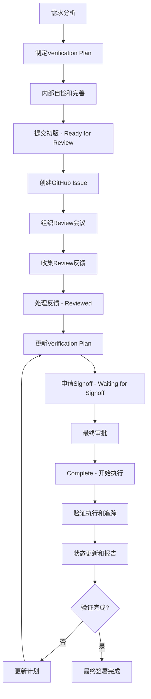

# 验证计划工作流程和管理实践

基于CV32E40P项目的成功经验，本章详细介绍verification plan的完整生命周期管理，包括GitHub Issue驱动的审查流程、4阶段状态管理和团队协作最佳实践。

## 🔄 Verification Plan生命周期概览

### 完整工作流程图



## 📋 4阶段状态管理详解

基于CV32E40P项目的`README.md`状态定义，verification plan采用标准化的4阶段管理：

### Stage 1: Ready for Review 📝

**定义：** 验证计划已制定完成，等待正式审查

**入口条件：**
- [ ] 所有必填字段已完成
- [ ] 内部自检通过质量标准
- [ ] 需求追溯链完整
- [ ] 验证目标明确具体
- [ ] 覆盖率策略清晰

**工作内容：**
1. **最终质量检查**
   ```bash
   # 质量检查清单
   ├── 完整性检查: 所有行都有有效内容
   ├── 一致性检查: 术语和格式统一
   ├── 追溯性检查: 每个条目都能追溯到需求
   ├── 可执行性检查: Pass/Fail Criteria可操作
   └── 覆盖率检查: Coverage Method与环境匹配
   ```

2. **文档准备**
   - 生成clean版本的Excel文档
   - 准备PowerPoint review材料
   - 收集相关的需求文档链接
   - 准备review会议议程

**输出标准：**
- ✅ 完整的Excel verification plan文档
- ✅ Review准备材料 (PPT, 需求文档等)
- ✅ GitHub Issue创建完成
- ✅ Review会议安排完成

### Stage 2: Reviewed 🔍

**定义：** 验证计划已审查，等待处理review反馈

**工作内容：**
1. **审查会议执行**
   - 按照标准议程进行review
   - 记录所有review comments
   - 明确action items和负责人
   - 确定后续timeline

2. **反馈收集和分类**
   ```
   Review反馈分类：
   ├── Critical Issues - 必须修复才能继续
   ├── Major Issues - 重要问题，需要重新设计
   ├── Minor Issues - 小问题，可快速修复
   └── Suggestions - 建议性改进，optional
   ```

3. **修复计划制定**
   - 为每个反馈制定解决方案
   - 评估修复工作量和时间
   - 确定优先级和timeline

**关键活动：**
- 📝 记录详细的review minutes
- 📋 创建action item追踪表
- 📅 确定反馈处理timeline
- 👥 分配负责人和reviewer

### Stage 3: Waiting for Signoff ✅

**定义：** Review反馈已处理，等待reviewer最终签署

**入口条件：**
- [ ] 所有Critical和Major issues已解决
- [ ] 更新版本已提供给reviewer
- [ ] 所有action items已完成
- [ ] 修改记录清晰documented

**工作内容：**
1. **反馈处理验证**
   ```
   验证checklist：
   ├── Issue Resolution: 每个issue都有清晰的解决方案
   ├── Impact Analysis: 修改对其他部分的影响评估
   ├── Quality Check: 修改后仍满足质量标准
   └── Consistency Check: 修改保持整体一致性
   ```

2. **Signoff请求**
   - 向reviewers发送signoff请求
   - 提供修改对比和explanation
   - 设定signoff deadline
   - 跟踪signoff状态

**输出标准：**
- ✅ 所有review issues已解决
- ✅ 更新版本经过质量验证
- ✅ Review修改记录complete
- ✅ Signoff请求已发送

### Stage 4: Complete 🎯

**定义：** 验证计划已获得最终签署，可以开始执行

**标志事件：**
- ✅ 所有required reviewers已签署
- ✅ 管理层批准 (如需要)
- ✅ 验证计划版本locked
- ✅ 执行团队已获得最终版本

**后续活动：**
1. **执行准备**
   - 将verification plan分发给执行团队
   - 建立执行tracking机制
   - 初始化覆盖率收集系统
   - 设置定期review schedule

2. **基线管理**
   - 确定verification plan baseline版本
   - 建立变更控制流程
   - 设置状态报告机制
   - 准备项目kickoff

## 🔧 GitHub Issue驱动的Review流程

基于`VerificationPlanning101.md`的官方流程，CV32E40P采用标准化的GitHub workflow：

### Issue创建标准流程

**Step 1: Issue创建**
```markdown
Issue标题格式：
[Verification Plan Review] Feature_Name Verification Plan

Issue内容模板：
## Verification Plan Information
- **Plan Name**: Feature_Name_VerifPlan.xlsx
- **Version**: v1.0 (Initial Draft)
- **Author**: @username
- **GitHub Link**: [Link to Excel file]

## Review Request
This issue requests review of the verification plan for [Feature Name].

## Required Attendees
- [ ] @verification_lead
- [ ] @design_lead
- [ ] @feature_owner
- [ ] @verification_engineer

## Review Materials
- Excel Verification Plan: [link]
- PowerPoint Presentation: [link] (if applicable)
- Requirements Documents: [links]

## Timeline
- Review Meeting: [Date/Time]
- Target Completion: [Date]
```

**Step 2: 标签管理**
```
标签分类系统：
├── Type标签
│   ├── verification-plan
│   └── review-requested
├── Priority标签
│   ├── high-priority
│   ├── medium-priority
│   └── low-priority
├── Core标签 (如适用)
│   ├── cv32e40p
│   ├── cva6
│   └── core-independent
└── Status标签
    ├── ready-for-review
    ├── in-review
    ├── waiting-for-signoff
    └── completed
```

### Review会议组织最佳实践

**会议准备 (Review前1-2天):**

1. **发送会议通知**
   ```
   Meeting Agenda Template:

   Subject: [Verification Plan Review] Feature_Name

   ## Agenda
   1. Introduction and Overview (5 min)
   2. Verification Plan Walkthrough (20-30 min)
   3. Questions and Discussion (15-20 min)
   4. Action Items and Next Steps (5 min)

   ## Pre-Meeting Preparation
   - Please review the Excel document before the meeting
   - Add comments directly to the Excel file if possible
   - Prepare specific questions and concerns

   ## Meeting Materials
   - [Links to all materials]
   ```

2. **审查材料分发**
   - Excel verification plan文档
   - 相关需求文档links
   - PowerPoint presentation (如有)
   - 之前相关的verification plans (作为参考)

**会议执行 (45-60分钟):**

```
标准会议流程：
├── 开场和介绍 (5分钟)
│   ├── 会议目标和议程
│   ├── 参会者介绍
│   └── 时间管理说明
├── Verification Plan讲解 (20-30分钟)
│   ├── 功能概述和范围
│   ├── 关键验证目标walkthrough
│   ├── 覆盖率策略说明
│   └── 特殊considerations
├── 讨论和Q&A (15-20分钟)
│   ├── Technical questions
│   ├── 可行性讨论
│   ├── Resource和timeline评估
│   └── 风险和mitigation策略
└── Action Items和下一步 (5分钟)
    ├── 记录所有action items
    ├── 分配负责人和deadline
    ├── 确定后续review timeline
    └── 会议总结和感谢
```

**会议后续 (Review后24小时内):**

1. **会议纪要发布**
   ```markdown
   ## Meeting Minutes Template

   **Date**: [Date]
   **Attendees**: [List all attendees]
   **Duration**: [Duration]

   ## Decisions Made
   - [List key decisions]

   ## Action Items
   | Action | Owner | Due Date | Status |
   |--------|-------|----------|--------|
   | [Item 1] | @user | [date] | Open |

   ## Key Feedback
   - [Summarize major feedback points]

   ## Next Steps
   - [Timeline for next review/signoff]
   ```

2. **GitHub Issue更新**
   - 更新issue状态为"in-review" → "reviewed"
   - 添加会议纪要的link
   - 更新timeline和next milestones

## 📊 VplanStatusReviews.xlsx状态追踪机制

基于CV32E40P项目的`VplanStatusReviews.xlsx` (7KB)文档，项目采用centralized的状态追踪：

### 状态追踪表结构

```
推测的状态追踪表结构：
┌─────────────────┬──────────────┬─────────────┬──────────────┬─────────────┐
│ Feature/Module  │ Plan Status  │ Owner       │ Target Date  │ Comments    │
├─────────────────┼──────────────┼─────────────┼──────────────┼─────────────┤
│ OBI Interface   │ Complete     │ @engineer1  │ 2023-03-15   │ Signed off  │
│ CLINT Interrupt │ Signoff      │ @engineer2  │ 2023-03-20   │ Pending    │
│ Debug Interface │ Reviewed     │ @engineer3  │ 2023-03-25   │ Minor fixes │
│ Xpulp SIMD      │ Ready        │ @engineer4  │ 2023-03-30   │ Need review │
└─────────────────┴──────────────┴─────────────┴──────────────┴─────────────┘
```

### 状态更新workflow

**每周状态更新流程：**

1. **数据收集** (每周一)
   - 各feature owner更新自己的状态
   - 收集上周完成的milestones
   - 识别当前的blockers

2. **状态分析** (每周二)
   - 分析整体进度
   - 识别风险和延迟
   - 准备管理层报告

3. **团队同步** (每周三)
   - 在team meeting中同步状态
   - 讨论blockers和solutions
   - 调整timeline如需要

4. **文档更新** (每周四)
   - 更新master status表
   - 发布周状态报告
   - 更新项目dashboard

## 💼 团队协作最佳实践

### 跨功能团队协作模式

**核心角色和职责：**

```
Verification Plan团队结构：
├── Verification Plan Owner
│   ├── 负责plan制定和质量
│   ├── 协调review流程
│   ├── 处理review反馈
│   └── 跟踪执行进度
├── Design Lead/Feature Owner
│   ├── 提供设计需求clarification
│   ├── Review设计coverage完整性
│   ├── 确认验证目标合理性
│   └── 支持debug和问题解决
├── Verification Lead
│   ├── Review验证策略和方法
│   ├── 确认验证环境capability
│   ├── 评估resource和timeline
│   └── 批准最终plan
├── Project Manager
│   ├── 协调timeline和resource
│   ├── 跟踪milestone和deliverable
│   ├── 风险管理和escalation
│   └── 跨team communication
└── Domain Experts (按需)
    ├── Architecture specialist
    ├── Tool/methodology expert
    ├── Customer/application expert
    └── Standards compliance expert
```

### 有效沟通机制

**1. 定期同步会议**
```
Meeting Schedule:
├── 每日standup (15分钟)
│   ├── 昨日progress
│   ├── 今日plan
│   └── Blockers和help needed
├── 每周plan review (30分钟)
│   ├── Plan status update
│   ├── Issue discussion
│   └── Next week priorities
├── 每月milestone review (60分钟)
│   ├── Overall progress assessment
│   ├── Quality metrics review
│   └── Timeline和resource adjustment
└── 季度strategy review (120分钟)
    ├── Methodology improvement
    ├── Lessons learned
    └── Best practice sharing
```

**2. 文档化沟通**
```
Documentation Standards:
├── 所有decision都要documented
├── Meeting minutes必须在24小时内发布
├── Action items要有clear owner和deadline
├── Status updates要定期和consistent
└── Issue tracking要complete和up-to-date
```

### 质量保证机制

**1. Peer Review流程**
```
Review质量保证：
├── Multiple reviewers: 至少2个不同角色的reviewer
├── Review checklist: 标准化的review要点
├── Review training: 确保reviewer具备必要技能
└── Review metrics: 跟踪review质量和效果
```

**2. 持续改进机制**
```
Improvement Process:
├── Retrospective meetings: 定期回顾和改进
├── Metrics collection: 收集process和quality指标
├── Best practice sharing: 跨project的经验分享
└── Tool和template improvement: 持续优化工具
```

## 🚨 常见问题和解决方案

### 问题1: Review周期过长

**现象：** Review从开始到signoff需要3-4周

**根因分析：**
- Review scheduling困难，参与者calendar冲突
- Review feedback处理不及时
- 多轮review导致循环延迟

**解决方案：**
```
加速Review的策略：
├── 提前2周预定review meetings
├── 建立backup reviewer机制
├── 设置review SLA (Service Level Agreement)
├── 使用asynchronous review工具
└── 实施lightweight review process for minor changes
```

### 问题2: Review质量不均匀

**现象：** 不同reviewer的review深度和质量差异很大

**解决方案：**
```
标准化Review质量：
├── 制定详细的review checklist
├── 提供reviewer training
├── 建立review quality metrics
├── 实施peer review for reviewers
└── 定期calibration sessions
```

### 问题3: 状态追踪不及时

**现象：** 项目状态更新滞后，影响决策

**解决方案：**
```
改善状态追踪：
├── 自动化状态收集工具
├── 定期reminder和escalation机制
├── Dashboard和实时可视化
├── 强制性的weekly update policy
└── 集成到daily workflow中
```

---

**下一步：** 学习 [CVA6验证计划制定实战](05-cva6-vplan-development.md)，将CV32E40P的成功经验应用到新的64位RISC-V核心验证项目中。