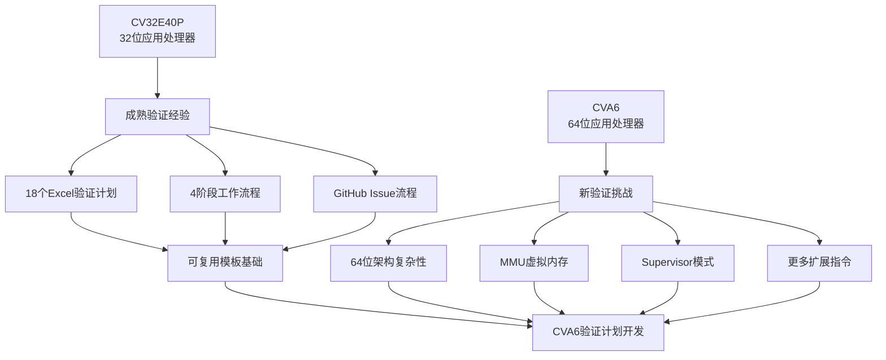

# CVA6验证计划制定实战指南

基于CV32E40P成功经验，本章提供CVA6 64位RISC-V核心验证计划制定的完整实战指南，包括32位到64位的适配策略、架构差异分析和实际制定流程。

## 🎯 CVA6项目验证挑战概览

### CVA6 vs CV32E40P 关键差异



## 🏗️ CVA6架构复杂性分析

### 1. 指令集架构差异

**CV32E40P (32位) vs CVA6 (64位) 对比：**

| 功能领域 | CV32E40P | CVA6 | 验证复杂度变化 |
|----------|----------|------|----------------|
| **基础指令集** | RV32I | RV64I | ⬆️ +100% (64位操作) |
| **整数乘除** | RV32M | RV64M | ⬆️ +80% (64位乘除) |
| **原子操作** | - | RV64A | ➕ 全新验证领域 |
| **浮点运算** | - | RV64F/D | ➕ 全新验证领域 |
| **压缩指令** | RV32C | RV64C | ⬆️ +60% (64位压缩) |
| **特权模式** | M-Mode | M/S/U-Mode | ➕ 虚拟化和特权切换 |
| **内存管理** | 物理地址 | MMU + 虚拟地址 | ➕ 全新复杂验证 |

### 2. 系统级功能扩展

**CVA6新增的系统级特性：**

```
CVA6系统级功能树：
├── 特权模式管理
│   ├── Machine Mode (M-Mode)
│   ├── Supervisor Mode (S-Mode) ⭐新增
│   ├── User Mode (U-Mode) ⭐新增
│   └── 特权级切换验证
├── 内存管理单元 (MMU) ⭐全新
│   ├── Sv39页表机制
│   ├── TLB (Translation Lookaside Buffer)
│   ├── 虚拟地址翻译
│   └── 页面保护和权限
├── 缓存系统 ⭐新增
│   ├── 指令缓存 (I-Cache)
│   ├── 数据缓存 (D-Cache)
│   ├── 缓存一致性
│   └── 缓存刷新和无效
├── 高级中断系统
│   ├── 平台级中断控制器 (PLIC)
│   ├── 核心本地中断器 (CLINT)
│   └── 高级中断路由
└── 性能监控
    ├── 硬件性能计数器
    ├── 性能事件跟踪
    └── 调试和分析支持
```

## 📋 CVA6验证计划制定策略

### Phase 1: CV32E40P经验分析与复用评估

**Step 1: 经验资产盘点**

基于CV32E40P验证计划资产，制定复用策略：

```
CV32E40P验证计划复用评估：
├── 直接复用 (90%+相似度)
│   ├── 基础RV32I → RV64I (需要扩展到64位)
│   ├── 中断系统 → 扩展中断系统
│   ├── 调试接口 → 基本调试功能
│   └── CSR寄存器 → 基础CSR部分
├── 适配复用 (50-90%相似度)
│   ├── OBI总线 → AXI/其他总线接口
│   ├── 流水线 → CVA6流水线架构
│   ├── 异常处理 → 扩展异常和特权模式
│   └── 性能计数器 → 扩展性能监控
├── 参考设计 (30-50%相似度)
│   ├── Xpulp扩展 → CVA6专用扩展
│   ├── 睡眠模式 → 电源管理
│   └── 专用优化 → CVA6特定优化
└── 全新开发 (<30%相似度)
    ├── MMU虚拟内存管理 ⭐
    ├── 缓存系统验证 ⭐
    ├── 原子操作指令 ⭐
    ├── 浮点运算单元 ⭐
    ├── Supervisor模式 ⭐
    └── 虚拟化支持 ⭐
```

### Phase 2: CVA6验证计划架构设计

**CVA6验证计划文档架构：**

根据复杂度分析，建议的Excel文档结构：

```
推荐的CVA6验证计划文档集合：
├── 01_核心指令集验证
│   ├── CVA6_RV64I_VerifPlan.xlsx (基于CV32E40P_I适配)
│   ├── CVA6_RV64M_VerifPlan.xlsx (基于CV32E40P_M扩展)
│   ├── CVA6_RV64A_VerifPlan.xlsx (全新：原子操作)
│   ├── CVA6_RV64F_VerifPlan.xlsx (全新：单精度浮点)
│   ├── CVA6_RV64D_VerifPlan.xlsx (全新：双精度浮点)
│   └── CVA6_RV64C_VerifPlan.xlsx (基于CV32E40P_C适配)
├── 02_系统级功能验证
│   ├── CVA6_PrivilegedISA_VerifPlan.xlsx (全新：特权指令集)
│   ├── CVA6_MMU_VerifPlan.xlsx (全新：内存管理单元)
│   ├── CVA6_Cache_VerifPlan.xlsx (全新：缓存系统)
│   ├── CVA6_Interrupts_VerifPlan.xlsx (基于CV32E40P适配)
│   └── CVA6_CSR_VerifPlan.xlsx (基于CV32E40P大幅扩展)
├── 03_微架构功能验证
│   ├── CVA6_Pipeline_VerifPlan.xlsx (基于CV32E40P参考设计)
│   ├── CVA6_BusInterface_VerifPlan.xlsx (基于OBI适配到AXI)
│   ├── CVA6_Debug_VerifPlan.xlsx (基于CV32E40P适配)
│   └── CVA6_Performance_VerifPlan.xlsx (基于CV32E40P扩展)
└── 04_系统集成验证
    ├── CVA6_SystemIntegration_VerifPlan.xlsx (全新)
    ├── CVA6_PowerManagement_VerifPlan.xlsx (全新)
    └── CVA6_Compliance_VerifPlan.xlsx (基于CV32E40P扩展)
```

## 🔧 实际制定流程：以CVA6_MMU为例

### Step 1: 需求分析和功能分解

**MMU功能分解（CVA6全新功能）：**

根据RISC-V特权规范和CVA6设计文档：

| Requirement Location | Feature | Sub-Feature | Verification Goals |
|---------------------|---------|-------------|-------------------|
| RISC-V Priv Spec 4.3.1 | Sv39 Page Table | Page Table Walk | • Verify 3-level page walk<br/>• Verify PTE format parsing<br/>• Verify address translation |
| RISC-V Priv Spec 4.3.1 | Sv39 Page Table | TLB Management | • Verify TLB hit/miss behavior<br/>• Verify TLB replacement policy<br/>• Verify SFENCE.VMA operation |
| RISC-V Priv Spec 4.3.2 | Memory Protection | Page Permissions | • Verify R/W/X permission checks<br/>• Verify User/Supervisor access<br/>• Verify access fault generation |
| RISC-V Priv Spec 4.4.1 | Address Translation | Virtual Address | • Verify 39-bit VA translation<br/>• Verify address space layout<br/>• Verify canonical address check |
| CVA6 Spec Ch 3.2 | MMU Implementation | PTW (Page Table Walker) | • Verify hardware page walker<br/>• Verify PTW state machine<br/>• Verify PTW cache interaction |

### Step 2: 验证目标详细化

**MMU验证目标的Pass/Fail Criteria设计：**

```
MMU验证目标示例：
┌─────────────────┬─────────────────┬─────────────────┬─────────────────┐
│ Feature         │ Verification    │ Pass/Fail       │ Coverage        │
│                 │ Goals           │ Criteria        │ Method          │
├─────────────────┼─────────────────┼─────────────────┼─────────────────┤
│ Address         │ 39-bit VA to    │ Self-checking   │ Functional      │
│ Translation     │ 56-bit PA       │ with reference  │ Coverage:       │
│                 │ translation     │ model           │ - All VA ranges │
│                 │ correctness     │                 │ - Page sizes    │
│                 │                 │                 │ - Permission    │
├─────────────────┼─────────────────┼─────────────────┼─────────────────┤
│ TLB Hit/Miss    │ TLB lookup      │ Assertion       │ Code Coverage:  │
│ Behavior        │ behavior        │ checking +      │ - TLB state     │
│                 │ verification    │ Signature check │ - Cache lines   │
├─────────────────┼─────────────────┼─────────────────┼─────────────────┤
│ Page Fault      │ Correct fault   │ Exception       │ Functional      │
│ Generation      │ generation for  │ handler verify  │ Coverage:       │
│                 │ invalid access  │                 │ - Fault types   │
│                 │                 │                 │ - Error codes   │
└─────────────────┴─────────────────┴─────────────────┴─────────────────┘
```

### Step 3: 覆盖率模型设计

**CVA6 MMU功能覆盖率设计：**

```systemverilog
// CVA6 MMU Coverage Model 示例
covergroup mmu_translation_cg;
  // Virtual Address Coverage
  cp_va_range: coverpoint virtual_addr[38:30] {
    bins low_range = {[0:127]};
    bins mid_range = {[128:383]};
    bins high_range = {[384:511]};
  }

  // Page Size Coverage
  cp_page_size: coverpoint page_size {
    bins page_4k = {PAGE_4KB};
    bins page_2m = {PAGE_2MB};
    bins page_1g = {PAGE_1GB};
  }

  // Permission Coverage
  cp_permissions: coverpoint {pte.r, pte.w, pte.x} {
    bins read_only = {3'b100};
    bins read_write = {3'b110};
    bins read_execute = {3'b101};
    bins read_write_execute = {3'b111};
    illegal_bins invalid = {3'b000, 3'b001, 3'b010, 3'b011};
  }

  // Privilege Mode Coverage
  cp_privilege: coverpoint current_mode {
    bins machine = {M_MODE};
    bins supervisor = {S_MODE};
    bins user = {U_MODE};
  }

  // TLB State Coverage
  cp_tlb_state: coverpoint tlb_hit {
    bins hit = {1};
    bins miss = {0};
  }

  // Cross Coverage - Critical Combinations
  cross_access_scenario: cross cp_permissions, cp_privilege, cp_tlb_state {
    // 排除无效组合
    ignore_bins invalid_machine = cross_access_scenario with
      (cp_privilege == M_MODE && cp_permissions == 3'b000);
  }

  cross_translation_complexity: cross cp_va_range, cp_page_size, cp_tlb_state;
endgroup
```

## 📊 CVA6验证计划实施roadmap

### Phase 1: 基础架构验证 (3-4个月)

```
Month 1-2: 核心指令集验证计划
├── Week 1-2: RV64I基础指令适配 (基于CV32E40P_I)
│   ├── 复用CV32E40P_I_VerifPlan.xlsx基础结构
│   ├── 扩展32位操作到64位操作
│   ├── 添加64位立即数处理
│   └── 更新覆盖率模型为64位
├── Week 3-4: RV64M乘除法扩展 (基于CV32E40P_M)
│   ├── 适配32位乘除到64位乘除
│   ├── 添加64位乘法结果处理
│   ├── 扩展除法异常情况
│   └── 更新性能测试用例
├── Week 5-6: RV64C压缩指令适配 (基于CV32E40P_C)
│   ├── 复用压缩指令基础框架
│   ├── 添加64位压缩指令编码
│   ├── 验证压缩指令扩展正确性
│   └── 更新指令对齐检查
├── Week 7-8: 新增原子操作 RV64A (全新开发)
│   ├── 制定原子操作验证计划
│   ├── 设计原子操作覆盖率模型
│   ├── 开发原子操作测试场景
│   └── 集成到验证环境

Month 3-4: 系统级功能验证计划
├── Week 9-10: 特权模式验证计划 (全新开发)
│   ├── M/S/U模式切换验证
│   ├── 特权指令访问控制
│   ├── 异常和中断处理扩展
│   └── CSR寄存器权限验证
├── Week 11-12: MMU验证计划 (全新开发)
│   ├── Sv39页表机制验证
│   ├── TLB管理验证
│   ├── 虚拟地址翻译验证
│   └── 内存保护验证
├── Week 13-14: 中断系统扩展 (基于CV32E40P适配)
│   ├── 复用CV32E40P中断基础
│   ├── 添加Supervisor模式中断
│   ├── 扩展PLIC支持
│   └── 更新中断优先级处理
└── Week 15-16: 浮点单元验证计划 (全新开发)
    ├── RV64F单精度浮点验证
    ├── RV64D双精度浮点验证
    ├── 浮点异常处理验证
    └── 浮点CSR寄存器验证
```

### Phase 2: 微架构和系统集成验证 (2-3个月)

```
Month 5-6: 微架构验证计划
├── Week 17-18: CVA6流水线验证 (基于CV32E40P参考)
│   ├── 适配CVA6 6级流水线
│   ├── 分支预测验证
│   ├── 流水线冲突处理
│   └── 性能计数器集成
├── Week 19-20: 缓存系统验证 (全新开发)
│   ├── I-Cache验证计划
│   ├── D-Cache验证计划
│   ├── 缓存一致性验证
│   └── 缓存性能验证
├── Week 21-22: 总线接口验证 (基于OBI适配)
│   ├── 从OBI适配到AXI协议
│   ├── 总线事务验证
│   ├── 内存访问优化验证
│   └── 总线错误处理
└── Week 23-24: 调试系统验证 (基于CV32E40P适配)
    ├── 复用基础调试功能
    ├── 添加64位调试支持
    ├── 扩展断点和观察点
    └── 调试性能优化

Month 7: 系统集成和合规性验证
├── Week 25-26: 系统集成验证 (全新开发)
│   ├── 多核心协作验证
│   ├── 系统启动验证
│   ├── 操作系统支持验证
│   └── 应用程序兼容性
├── Week 27-28: 合规性验证 (基于CV32E40P扩展)
│   ├── RISC-V架构测试适配
│   ├── 特权规范合规性
│   ├── 浮点标准合规性
│   └── 性能基准测试
```

## 🛠️ CVA6验证计划开发工具和方法

### 1. Excel模板适配工具

**从CV32E40P到CVA6的自动化适配：**

```bash
# 建议的Excel处理脚本框架
#!/bin/bash
# CVA6 Verification Plan Generator

# Step 1: 复制CV32E40P基础模板
cp cv32e40p/docs/VerifPlans/CV32E40P_*_VerifPlan.xlsx \
   cva6/docs/VerifPlans/

# Step 2: 批量重命名
cd cva6/docs/VerifPlans/
for file in CV32E40P_*; do
    mv "$file" "${file/CV32E40P/CVA6}"
done

# Step 3: 使用Python脚本批量更新内容
python3 adapt_vplan_cv32e40p_to_cva6.py
```

### 2. 覆盖率模型扩展策略

**从32位到64位覆盖率的系统化扩展：**

```systemverilog
// 示例：从CV32E40P到CVA6的覆盖率适配
class cva6_coverage_adapter;
  // 32位到64位的数据宽度适配
  function automatic void adapt_data_width_coverage();
    // CV32E40P: 32位数据覆盖率
    // bins data_range[] = {[0:32'hFFFFFFFF]};

    // CVA6: 64位数据覆盖率
    bins data_range[] = {
      [64'h0000000000000000:64'h00000000FFFFFFFF], // 低32位
      [64'h0000000100000000:64'hFFFFFFFF00000000], // 高32位
      [64'hFFFFFFFF00000000:64'hFFFFFFFFFFFFFFFF]  // 全范围
    };
  endfunction

  // 地址空间扩展：从32位物理地址到39位虚拟地址
  function automatic void adapt_address_coverage();
    // CV32E40P: 32位物理地址
    // bins addr_range[] = {[0:32'hFFFFFFFF]};

    // CVA6: 39位虚拟地址空间
    bins va_user_space = {[39'h000000000:39'h0FFFFFFFF]};
    bins va_supervisor = {[39'h100000000:39'h1FFFFFFFF]};
    bins va_kernel_space = {[39'h7FC000000:39'h7FFFFFFFF]};
  endfunction
endclass
```

### 3. 验证环境迁移指导

**UVM测试环境的系统化迁移：**

```systemverilog
// CVA6 UVM环境适配框架
class cva6_testbench_adapter extends uvm_object;

  // 从CV32E40P环境继承基础组件
  cv32e40p_instruction_monitor i_mon; // 复用指令监控
  cv32e40p_memory_interface mem_if;   // 适配内存接口

  // CVA6特有组件
  cva6_mmu_monitor mmu_mon;          // 新增MMU监控
  cva6_cache_monitor cache_mon;      // 新增缓存监控
  cva6_privilege_monitor priv_mon;   // 新增特权模式监控

  function void build_phase(uvm_phase phase);
    // 复用CV32E40P成熟组件
    i_mon = cv32e40p_instruction_monitor::type_id::create("i_mon");

    // 适配内存接口到64位
    mem_if = cv32e40p_memory_interface::type_id::create("mem_if");
    mem_if.set_data_width(64);

    // 构建CVA6特有组件
    mmu_mon = cva6_mmu_monitor::type_id::create("mmu_mon");
    cache_mon = cva6_cache_monitor::type_id::create("cache_mon");
    priv_mon = cva6_privilege_monitor::type_id::create("priv_mon");
  endfunction

endclass
```

## 📈 CVA6验证计划质量保证

### 1. 复用质量验证

**确保从CV32E40P复用内容的质量：**

```
复用质量检查清单：
├── 功能映射正确性
│   ├── ✅ 32位指令正确映射到64位
│   ├── ✅ 寄存器宽度正确扩展
│   ├── ✅ 立即数处理正确适配
│   └── ✅ 内存访问模式正确更新
├── 覆盖率模型完整性
│   ├── ✅ 边界条件更新到64位
│   ├── ✅ 交叉覆盖率正确扩展
│   ├── ✅ 异常情况覆盖完整
│   └── ✅ 性能场景覆盖更新
├── 测试场景相关性
│   ├── ✅ CV32E40P场景在CVA6仍有效
│   ├── ✅ 删除CVA6不支持的特性
│   ├── ✅ 新增CVA6特有场景
│   └── ✅ 更新测试参数范围
└── 文档一致性
    ├── ✅ 术语统一更新为CVA6
    ├── ✅ 需求引用正确更新
    ├── ✅ 版本信息正确标记
    └── ✅ 审查记录完整保持
```

### 2. 新增功能验证计划质量

**CVA6特有功能的验证计划质量标准：**

| 质量维度 | MMU验证计划 | 浮点验证计划 | 特权模式验证 |
|----------|-------------|-------------|-------------|
| **需求覆盖** | 100%覆盖Sv39规范 | 100%覆盖IEEE754 | 100%覆盖特权规范 |
| **功能分解** | 页表/TLB/保护机制 | F/D扩展/异常/CSR | M/S/U模式切换 |
| **验证深度** | 地址翻译+权限+异常 | 运算精度+舍入+标志 | 权限检查+切换+异常 |
| **覆盖率设计** | VA范围+页大小+权限 | 操作数+结果+异常 | 模式+权限+转换 |
| **集成考虑** | 与缓存/总线集成 | 与整数单元集成 | 与中断/异常集成 |

## 🎯 CVA6项目成功标准

### 短期目标 (前6个月)

- ✅ **完成15+个核心验证计划** (基于18个CV32E40P计划适配+新增)
- ✅ **建立CVA6验证环境基础** (UVM testbench + 覆盖率收集)
- ✅ **完成基础指令集验证** (RV64I/M/C + 新增RV64A)
- ✅ **实现关键系统功能验证** (MMU + 特权模式)

### 中期目标 (6-12个月)

- ✅ **完成所有ISA扩展验证** (包括浮点单元RV64F/D)
- ✅ **系统级功能验证完成** (缓存 + 中断 + 调试)
- ✅ **性能和合规性验证** (基准测试 + 架构测试通过)
- ✅ **验证环境成熟度** (自动化程度 + 覆盖率达标)

### 长期目标 (12个月+)

- ✅ **CVA6验证计划成为标杆** (供其他64位RISC-V项目复用)
- ✅ **验证方法学贡献** (向OpenHW Group贡献最佳实践)
- ✅ **工具链和流程优化** (提升验证效率和质量)
- ✅ **团队能力建设** (培养CVA6和64位RISC-V验证专家)

---

**下一步：** 学习 [验证计划审查和追踪](06-vplan-review-and-tracking.md)，掌握CVA6验证计划在项目全生命周期的管理和优化方法。