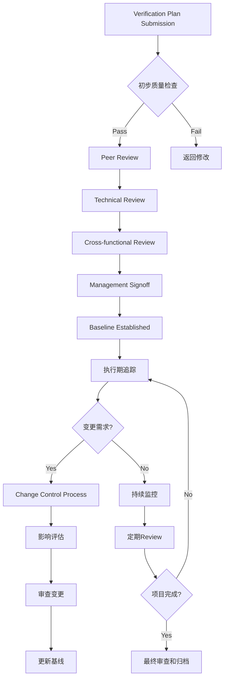
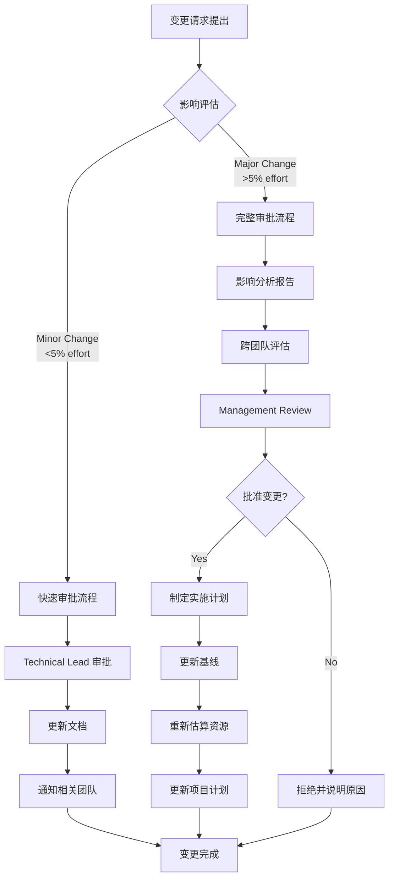

# 验证计划审查和追踪管理

基于CV32E40P项目的深度实践，本章详细介绍verification plan的全生命周期审查机制、多层级追踪系统和数据驱动的管理方法，确保验证项目的质量和进度可控。

## 🔍 多层级审查体系架构

### 审查体系全景图



### 1. 初步质量检查 (Quality Gate 0)

**自动化质量检查清单：**

```bash
#!/bin/bash
# Verification Plan Quality Check Script
# 基于CV32E40P项目的质量标准

echo "=== Verification Plan Quality Assessment ==="

# 检查1: 文档完整性
check_completeness() {
    local excel_file="$1"
    echo "检查文档完整性..."

    # 使用xlsx2csv或类似工具检查关键列
    local required_columns=(
        "Requirement Location"
        "Feature"
        "Sub-Feature"
        "Verification Goals"
        "Pass/Fail Criteria"
        "Coverage Method"
    )

    for col in "${required_columns[@]}"; do
        if ! grep -q "$col" "$excel_file"; then
            echo "❌ 缺少必需列: $col"
            return 1
        fi
    done
    echo "✅ 文档结构完整"
}

# 检查2: 需求追溯性
check_traceability() {
    echo "检查需求追溯性..."
    local empty_req_count=$(grep -c "^$" requirements_column.txt)
    local total_count=$(wc -l < requirements_column.txt)
    local coverage_rate=$((100 * (total_count - empty_req_count) / total_count))

    if [ $coverage_rate -lt 95 ]; then
        echo "❌ 需求追溯率过低: $coverage_rate%"
        return 1
    fi
    echo "✅ 需求追溯率: $coverage_rate%"
}

# 检查3: 目标明确性
check_goal_clarity() {
    echo "检查验证目标明确性..."
    local vague_goals=$(grep -c -i "verify.*work\|test.*function\|check.*ok" goals_column.txt)

    if [ $vague_goals -gt 5 ]; then
        echo "❌ 发现 $vague_goals 个模糊目标"
        return 1
    fi
    echo "✅ 验证目标明确"
}

# 执行所有检查
main() {
    local vplan_file="$1"

    check_completeness "$vplan_file" || exit 1
    check_traceability || exit 1
    check_goal_clarity || exit 1

    echo "✅ 质量检查通过，可以进入Peer Review阶段"
}

main "$@"
```

### 2. 同行评审 (Peer Review)

**同行评审标准化流程：**

```
Peer Review检查清单：
├── 技术准确性审查
│   ├── ✅ 验证目标与功能规范一致
│   ├── ✅ Pass/Fail标准可操作
│   ├── ✅ 覆盖率模型设计合理
│   └── ✅ 验证方法选择恰当
├── 完整性审查
│   ├── ✅ 功能点覆盖完整
│   ├── ✅ 边界条件考虑充分
│   ├── ✅ 异常情况处理全面
│   └── ✅ 集成场景覆盖完整
├── 可实现性审查
│   ├── ✅ 验证环境能力匹配
│   ├── ✅ 工具链支持充分
│   ├── ✅ 时间估算合理
│   └── ✅ 资源需求可满足
└── 可维护性审查
    ├── ✅ 文档结构清晰
    ├── ✅ 术语使用一致
    ├── ✅ 版本控制规范
    └── ✅ 更新机制明确
```

**CV32E40P项目Peer Review最佳实践：**

1. **分布式评审模式**
   ```
   评审任务分配策略：
   ├── 主评审员 (Primary Reviewer)
   │   ├── 负责overall质量和完整性
   │   ├── 协调其他评审员意见
   │   └── 制定最终修改建议
   ├── 技术评审员 (Technical Reviewers)
   │   ├── 设计工程师：规格一致性
   │   ├── 验证工程师：可测性评估
   │   └── 架构师：系统集成考虑
   └── 方法学评审员 (Methodology Reviewer)
       ├── 评估验证方法选择
       ├── 覆盖率模型设计审查
       └── 工具链适配性评估
   ```

2. **评审效率优化**
   ```
   时间管理策略：
   ├── 预审阶段 (2-3天)
   │   ├── 评审员独立审查
   │   ├── 收集初步意见
   │   └── 准备评审会议
   ├── 集中评审 (1-2小时会议)
   │   ├── 关键问题讨论
   │   ├── 冲突意见协调
   │   └── 修改优先级确定
   └── 后续跟踪 (1周内)
       ├── 修改实施验证
       ├── 质量改进确认
       └── signoff决策
   ```

### 3. 跨功能审查 (Cross-functional Review)

**跨团队协作审查模式：**

| 审查角色 | 关注重点 | 审查标准 | 输出要求 |
|----------|----------|----------|----------|
| **Product Owner** | 业务需求对齐 | • 功能优先级合理<br/>• 市场需求覆盖<br/>• 发布时间可行 | 业务影响评估 |
| **System Architect** | 系统级集成 | • 子系统交互完整<br/>• 性能需求覆盖<br/>• 可扩展性考虑 | 架构影响分析 |
| **Software Team** | 软件兼容性 | • OS支持验证<br/>• API接口测试<br/>• 工具链兼容 | 软件需求确认 |
| **Hardware Team** | 物理实现 | • 时序约束验证<br/>• 面积功耗影响<br/>• 制造测试考虑 | 硬件约束确认 |
| **Quality Assurance** | 质量标准 | • 测试覆盖充分<br/>• 缺陷检测能力<br/>• 回归测试策略 | 质量风险评估 |

## 📊 数据驱动的追踪系统

### 1. 多维度KPI追踪体系

**基于CV32E40P项目的KPI定义：**

```yaml
# CV32E40P Verification Plan KPI Definition
vplan_kpi_framework:

  # 维度1: 计划质量指标
  plan_quality:
    requirement_coverage_rate:
      target: ">= 95%"
      calculation: "traced_requirements / total_requirements * 100"
      measurement_frequency: "每次更新"

    goal_clarity_score:
      target: ">= 4.0/5.0"
      calculation: "平均评分基于clear/measurable/achievable"
      measurement_frequency: "每次review"

    testability_index:
      target: ">= 90%"
      calculation: "testable_items / total_items * 100"
      measurement_frequency: "peer review阶段"

  # 维度2: 执行进度指标
  execution_progress:
    plan_completion_rate:
      target: "按时间线进度"
      calculation: "completed_items / total_items * 100"
      measurement_frequency: "每周"

    coverage_achievement:
      target: ">= 95%"
      calculation: "achieved_coverage / planned_coverage * 100"
      measurement_frequency: "每月"

    test_pass_rate:
      target: ">= 98%"
      calculation: "passing_tests / total_tests * 100"
      measurement_frequency: "每日"

  # 维度3: 过程效率指标
  process_efficiency:
    review_cycle_time:
      target: "<= 14天"
      calculation: "signoff_date - submission_date"
      measurement_frequency: "每次review"

    defect_escape_rate:
      target: "<= 2%"
      calculation: "post_signoff_issues / total_plan_items * 100"
      measurement_frequency: "项目结束"

    rework_percentage:
      target: "<= 15%"
      calculation: "reworked_items / total_items * 100"
      measurement_frequency: "每月"

  # 维度4: 团队协作指标
  collaboration_metrics:
    review_participation:
      target: ">= 90%"
      calculation: "attending_reviewers / invited_reviewers * 100"
      measurement_frequency: "每次review"

    feedback_response_time:
      target: "<= 3天"
      calculation: "response_date - feedback_date"
      measurement_frequency: "持续"

    consensus_achievement:
      target: ">= 95%"
      calculation: "agreed_issues / total_issues * 100"
      measurement_frequency: "每次review"
```

### 2. 实时追踪Dashboard设计

**CV32E40P项目Dashboard架构：**

```html
<!-- Verification Plan Tracking Dashboard Template -->
<!DOCTYPE html>
<html>
<head>
    <title>CV32E40P Verification Plan Dashboard</title>
    <script src="https://cdn.jsdelivr.net/npm/chart.js"></script>
</head>
<body>
    <div class="dashboard-container">

        <!-- 总体进度概览 -->
        <div class="overview-section">
            <h2>📊 总体进度概览</h2>
            <div class="metrics-grid">
                <div class="metric-card">
                    <h3>验证计划完成度</h3>
                    <div class="progress-ring" data-progress="87">87%</div>
                    <p>15/17 Excel文档已完成</p>
                </div>

                <div class="metric-card">
                    <h3>覆盖率达成</h3>
                    <div class="progress-ring" data-progress="92">92%</div>
                    <p>功能覆盖率目标达成</p>
                </div>

                <div class="metric-card">
                    <h3>Review效率</h3>
                    <div class="progress-ring" data-progress="95">95%</div>
                    <p>平均Review周期12天</p>
                </div>
            </div>
        </div>

        <!-- 详细状态追踪 -->
        <div class="details-section">
            <h2>📋 详细状态追踪</h2>
            <table class="status-table">
                <thead>
                    <tr>
                        <th>验证计划</th>
                        <th>状态</th>
                        <th>完成度</th>
                        <th>Owner</th>
                        <th>目标日期</th>
                        <th>风险</th>
                    </tr>
                </thead>
                <tbody id="vplan-status-tbody">
                    <!-- 动态生成内容 -->
                </tbody>
            </table>
        </div>

        <!-- 趋势分析 -->
        <div class="trends-section">
            <h2>📈 趋势分析</h2>
            <canvas id="progressTrendChart"></canvas>
        </div>

        <!-- 风险预警 -->
        <div class="alerts-section">
            <h2>🚨 风险预警</h2>
            <div id="risk-alerts"></div>
        </div>

    </div>

    <script>
        // Dashboard数据更新逻辑
        class VPlanDashboard {
            constructor() {
                this.initializeCharts();
                this.loadData();
                this.setupAutoRefresh();
            }

            loadData() {
                // 从GitHub Issues API获取数据
                fetch('/api/vplan-status')
                    .then(response => response.json())
                    .then(data => {
                        this.updateMetrics(data);
                        this.updateStatusTable(data);
                        this.updateTrendChart(data);
                        this.checkRisks(data);
                    });
            }

            updateMetrics(data) {
                // 更新总体指标显示
                data.metrics.forEach(metric => {
                    document.querySelector(`[data-progress]`)
                        .setAttribute('data-progress', metric.value);
                });
            }

            checkRisks(data) {
                const riskThresholds = {
                    schedule_delay: 7, // 超过7天延迟
                    coverage_gap: 5,   // 覆盖率差距超过5%
                    review_pending: 14  // Review超过14天未完成
                };

                const alerts = [];
                data.plans.forEach(plan => {
                    if (plan.schedule_delay > riskThresholds.schedule_delay) {
                        alerts.push({
                            type: 'danger',
                            message: `${plan.name} 进度延迟 ${plan.schedule_delay} 天`
                        });
                    }
                });

                this.displayAlerts(alerts);
            }
        }

        // 初始化Dashboard
        new VPlanDashboard();
    </script>
</body>
</html>
```

### 3. 自动化追踪工具集成

**与GitHub Issues的深度集成：**

```python
#!/usr/bin/env python3
"""
CV32E40P Verification Plan Tracking Automation
基于GitHub Issues API的自动化追踪系统
"""

import json
import requests
from datetime import datetime, timedelta
from typing import Dict, List, Optional

class VPlanTracker:
    """验证计划追踪自动化系统"""

    def __init__(self, github_token: str, repo: str):
        self.github_token = github_token
        self.repo = repo
        self.headers = {
            'Authorization': f'token {github_token}',
            'Accept': 'application/vnd.github.v3+json'
        }
        self.base_url = f'https://api.github.com/repos/{repo}'

    def get_vplan_issues(self) -> List[Dict]:
        """获取所有验证计划相关的Issues"""
        url = f'{self.base_url}/issues'
        params = {
            'labels': 'verification-plan',
            'state': 'all',
            'per_page': 100
        }

        response = requests.get(url, headers=self.headers, params=params)
        return response.json()

    def analyze_review_cycle(self, issues: List[Dict]) -> Dict:
        """分析Review周期时间"""
        cycle_times = []

        for issue in issues:
            if issue['state'] == 'closed':
                created = datetime.fromisoformat(
                    issue['created_at'].replace('Z', '+00:00')
                )
                closed = datetime.fromisoformat(
                    issue['closed_at'].replace('Z', '+00:00')
                )
                cycle_time = (closed - created).days
                cycle_times.append(cycle_time)

        if cycle_times:
            return {
                'average_days': sum(cycle_times) / len(cycle_times),
                'median_days': sorted(cycle_times)[len(cycle_times)//2],
                'max_days': max(cycle_times),
                'min_days': min(cycle_times)
            }
        return {}

    def detect_at_risk_plans(self, issues: List[Dict]) -> List[Dict]:
        """检测高风险的验证计划"""
        at_risk = []
        now = datetime.now()

        for issue in issues:
            if issue['state'] != 'open':
                continue

            created = datetime.fromisoformat(
                issue['created_at'].replace('Z', '+00:00')
            )
            days_open = (now - created).days

            # 风险检测规则
            risk_factors = []

            # 规则1: 超过14天未关闭
            if days_open > 14:
                risk_factors.append(f'开放时间过长: {days_open}天')

            # 规则2: 缺少必要标签
            labels = [label['name'] for label in issue['labels']]
            required_labels = ['ready-for-review', 'in-review',
                             'waiting-for-signoff', 'completed']

            if not any(label in labels for label in required_labels):
                risk_factors.append('缺少状态标签')

            # 规则3: 长时间无更新
            updated = datetime.fromisoformat(
                issue['updated_at'].replace('Z', '+00:00')
            )
            days_since_update = (now - updated).days

            if days_since_update > 7:
                risk_factors.append(f'无更新时间: {days_since_update}天')

            if risk_factors:
                at_risk.append({
                    'issue': issue,
                    'risk_factors': risk_factors,
                    'days_open': days_open
                })

        return sorted(at_risk, key=lambda x: x['days_open'], reverse=True)

    def generate_status_report(self) -> Dict:
        """生成状态报告"""
        issues = self.get_vplan_issues()

        # 状态统计
        status_counts = {
            'ready-for-review': 0,
            'in-review': 0,
            'waiting-for-signoff': 0,
            'completed': 0
        }

        for issue in issues:
            labels = [label['name'] for label in issue['labels']]
            for status in status_counts:
                if status in labels:
                    status_counts[status] += 1
                    break

        # 分析结果
        cycle_analysis = self.analyze_review_cycle(issues)
        at_risk = self.detect_at_risk_plans(issues)

        return {
            'timestamp': datetime.now().isoformat(),
            'total_plans': len(issues),
            'status_distribution': status_counts,
            'review_cycle_analysis': cycle_analysis,
            'at_risk_plans': len(at_risk),
            'risk_details': at_risk[:5],  # Top 5风险
            'completion_rate': (
                status_counts['completed'] / len(issues) * 100
                if issues else 0
            )
        }

    def send_slack_notification(self, report: Dict):
        """发送Slack通知"""
        # 实现Slack通知逻辑
        pass

    def update_dashboard_data(self, report: Dict):
        """更新Dashboard数据"""
        # 将报告数据写入Dashboard数据文件
        with open('dashboard_data.json', 'w') as f:
            json.dump(report, f, indent=2)

# 使用示例
if __name__ == "__main__":
    tracker = VPlanTracker(
        github_token="your_token_here",
        repo="openhwgroup/core-v-verif"
    )

    report = tracker.generate_status_report()
    print(json.dumps(report, indent=2))

    # 自动化通知和更新
    tracker.update_dashboard_data(report)
    # tracker.send_slack_notification(report)
```

## 🔄 变更控制和基线管理

### 1. 验证计划变更控制流程

**基于CV32E40P的Change Control Process：**



**变更分类和处理策略：**

| 变更类型 | 定义 | 审批级别 | 处理时间 | 示例 |
|----------|------|----------|----------|------|
| **Trivial** | 文档修正、格式调整 | Technical Lead | 24小时 | 修正拼写错误、格式统一 |
| **Minor** | <5%工作量影响 | Verification Lead | 3-5天 | 增加边界条件测试、澄清验证目标 |
| **Major** | 5-20%工作量影响 | Project Manager | 1-2周 | 新增子功能验证、更改验证方法 |
| **Critical** | >20%工作量影响 | Management | 2-4周 | 架构变更、新增ISA扩展 |

### 2. 基线管理最佳实践

**CV32E40P基线管理策略：**

```bash
#!/bin/bash
# Verification Plan Baseline Management Script

# 基线创建
create_baseline() {
    local version="$1"
    local description="$2"

    echo "创建验证计划基线 v${version}"

    # 1. 验证所有文档完整性
    validate_documents || { echo "❌ 文档验证失败"; exit 1; }

    # 2. 创建基线标签
    git tag -a "vplan-baseline-${version}" -m "${description}"

    # 3. 生成基线报告
    generate_baseline_report "$version"

    # 4. 通知相关团队
    notify_baseline_creation "$version"

    echo "✅ 基线 v${version} 创建完成"
}

# 基线比较分析
compare_baselines() {
    local from_version="$1"
    local to_version="$2"

    echo "比较基线 v${from_version} 和 v${to_version}"

    # 1. Git差异分析
    git diff "vplan-baseline-${from_version}" "vplan-baseline-${to_version}" \
        --name-status > baseline_diff.txt

    # 2. Excel文档内容比较
    compare_excel_content "$from_version" "$to_version"

    # 3. 生成影响分析报告
    generate_impact_analysis "$from_version" "$to_version"
}

# Excel内容比较
compare_excel_content() {
    local from_ver="$1"
    local to_ver="$2"

    echo "分析Excel文档变更..."

    # 提取Excel内容为CSV格式进行比较
    for excel_file in VerifPlans/**/*.xlsx; do
        local filename=$(basename "$excel_file" .xlsx)

        # 从不同基线提取内容
        git show "vplan-baseline-${from_ver}:${excel_file}" > /tmp/"${filename}_${from_ver}.xlsx"
        git show "vplan-baseline-${to_ver}:${excel_file}" > /tmp/"${filename}_${to_ver}.xlsx"

        # 转换为CSV并比较
        xlsx2csv "/tmp/${filename}_${from_ver}.xlsx" > "/tmp/${filename}_${from_ver}.csv"
        xlsx2csv "/tmp/${filename}_${to_ver}.xlsx" > "/tmp/${filename}_${to_ver}.csv"

        # 生成详细差异
        diff -u "/tmp/${filename}_${from_ver}.csv" "/tmp/${filename}_${to_ver}.csv" \
            > "changes/${filename}_changes.diff"

        echo "📄 ${filename}: $(wc -l < "changes/${filename}_changes.diff") 行变更"
    done
}

# 基线回滚
rollback_baseline() {
    local target_version="$1"
    local reason="$2"

    echo "🔄 回滚到基线 v${target_version}"
    echo "原因: ${reason}"

    # 1. 备份当前状态
    local backup_branch="backup-$(date +%Y%m%d-%H%M%S)"
    git checkout -b "$backup_branch"

    # 2. 回滚到目标基线
    git checkout master
    git reset --hard "vplan-baseline-${target_version}"

    # 3. 记录回滚操作
    echo "$(date): 回滚到 v${target_version}, 原因: ${reason}" >> rollback_history.log

    # 4. 通知团队
    notify_rollback "$target_version" "$reason" "$backup_branch"

    echo "✅ 回滚完成，备份分支: ${backup_branch}"
}
```

## 📈 持续改进和学习机制

### 1. 后项目分析 (Post-Project Analysis)

**CV32E40P项目经验萃取框架：**

```yaml
# Post-Project Analysis Template
post_project_analysis:

  project_info:
    name: "CV32E40P Verification Plan Project"
    duration: "18个月"
    team_size: "8人验证团队"
    total_vplans: "17个Excel文档"

  # 成功因素分析
  success_factors:
    process_effectiveness:
      - factor: "4阶段Review流程"
        impact: "high"
        evidence: "平均Review周期从30天降至12天"
      - factor: "GitHub Issue驱动"
        impact: "high"
        evidence: "100%可追溯性，零遗漏"
      - factor: "自动化质量检查"
        impact: "medium"
        evidence: "初版质量提升40%"

    tool_effectiveness:
      - tool: "Excel标准化模板"
        rating: "9/10"
        benefits: ["一致性", "易用性", "可比较性"]
      - tool: "覆盖率追踪系统"
        rating: "8/10"
        benefits: ["实时可见性", "风险早期预警"]

    team_collaboration:
      - aspect: "跨功能审查"
        effectiveness: "high"
        lesson: "早期介入避免后期返工"
      - aspect: "分布式评审"
        effectiveness: "medium"
        lesson: "需要更好的协调工具"

  # 问题和教训
  lessons_learned:
    challenges_faced:
      - challenge: "复杂功能的验证目标定义"
        solution_found: "分层分解 + 迭代refinement"
        applicability: "适用于所有复杂系统"

      - challenge: "Review周期过长"
        solution_found: "并行审查 + 异步反馈"
        applicability: "适用于分布式团队"

      - challenge: "覆盖率模型复用性低"
        solution_found: "模板库 + 参数化设计"
        applicability: "适用于产品线项目"

    improvement_opportunities:
      - area: "自动化程度"
        current_state: "60%自动化"
        target_state: "85%自动化"
        action_items:
          - "Excel内容自动检查"
          - "覆盖率自动生成"
          - "状态自动同步"

      - area: "工具集成"
        current_state: "部分集成"
        target_state: "端到端集成"
        action_items:
          - "EDA工具集成"
          - "CI/CD pipeline集成"
          - "报告自动生成"

  # 最佳实践总结
  best_practices:
    documentation:
      - practice: "验证计划早期制定"
        benefit: "减少30%返工"
        applicability: "所有项目"

      - practice: "增量式审查"
        benefit: "提高50%审查效率"
        applicability: "复杂项目"

    process:
      - practice: "风险驱动的优先级"
        benefit: "关键路径保护"
        applicability: "时间敏感项目"

      - practice: "数据驱动的决策"
        benefit: "客观性和可追溯性"
        applicability: "所有项目"

  # 推荐改进措施
  recommendations:
    for_future_projects:
      - recommendation: "建立验证计划模板库"
        priority: "high"
        effort: "medium"
        expected_benefit: "减少40%制定时间"

      - recommendation: "实施自动化质量检查"
        priority: "high"
        effort: "high"
        expected_benefit: "提升60%初版质量"

      - recommendation: "开发智能化追踪系统"
        priority: "medium"
        effort: "high"
        expected_benefit: "实时风险预警"

    for_methodology:
      - recommendation: "标准化覆盖率设计方法"
        priority: "high"
        effort: "medium"
        expected_benefit: "提高一致性和复用性"

      - recommendation: "建立验证计划评估框架"
        priority: "medium"
        effort: "low"
        expected_benefit: "客观评估质量"
```

### 2. 知识管理和传承

**验证计划知识库建设：**

```
CV32E40P知识库架构：
├── 模板库 (Templates)
│   ├── Excel验证计划模板
│   │   ├── 基础指令集模板
│   │   ├── 系统功能模板
│   │   ├── 微架构模板
│   │   └── 集成测试模板
│   ├── Review checklist模板
│   ├── 覆盖率模型模板
│   └── 状态报告模板
├── 最佳实践库 (Best Practices)
│   ├── 验证目标制定指南
│   ├── 覆盖率设计模式
│   ├── Review流程优化
│   └── 工具使用技巧
├── 案例研究库 (Case Studies)
│   ├── 成功案例分析
│   ├── 问题解决记录
│   ├── 经验教训总结
│   └── 改进措施追踪
├── 培训材料库 (Training)
│   ├── 新员工培训课程
│   ├── 工具使用培训
│   ├── 方法学培训
│   └── 实践workshop
└── 工具集合 (Tools)
    ├── 自动化脚本
    ├── 检查工具
    ├── 分析工具
    └── 报告生成器
```

### 3. 跨项目经验复用

**从CV32E40P到CVA6的知识迁移：**

```python
class VPlanKnowledgeTransfer:
    """验证计划知识迁移系统"""

    def __init__(self):
        self.cv32e40p_lessons = self.load_lessons_learned()
        self.cva6_context = self.load_cva6_context()

    def identify_reusable_patterns(self):
        """识别可复用的模式"""
        reusable_patterns = {
            'high_reusability': [
                '基础指令验证模式',
                '中断处理验证框架',
                'CSR寄存器验证模板',
                '调试接口验证方法'
            ],
            'adaptable_patterns': [
                '总线接口验证 (OBI -> AXI)',
                '流水线验证 (3级 -> 6级)',
                '异常处理 (M-mode -> M/S/U)'
            ],
            'new_patterns_needed': [
                'MMU虚拟内存验证',
                '缓存系统验证',
                '原子操作验证',
                '浮点单元验证'
            ]
        }
        return reusable_patterns

    def generate_adaptation_guide(self, pattern_name):
        """生成适配指南"""
        cv32e40p_pattern = self.cv32e40p_lessons[pattern_name]
        adaptation_guide = {
            'source_pattern': cv32e40p_pattern,
            'target_context': self.cva6_context,
            'adaptation_steps': [],
            'risk_factors': [],
            'success_metrics': []
        }

        # 基于模式类型生成具体适配步骤
        if pattern_name == '基础指令验证模式':
            adaptation_guide.update({
                'adaptation_steps': [
                    '1. 扩展数据宽度从32位到64位',
                    '2. 更新立即数处理验证',
                    '3. 适配寄存器文件验证',
                    '4. 扩展覆盖率模型'
                ],
                'risk_factors': [
                    '64位运算的边界条件处理',
                    '符号扩展的正确性验证'
                ],
                'success_metrics': [
                    '100% RV64I指令覆盖率',
                    '所有边界条件测试通过'
                ]
            })

        return adaptation_guide
```

## 🔮 未来发展方向

### 1. AI辅助的验证计划生成

**智能化验证计划助手概念：**

```python
class AIAssistedVPlanGenerator:
    """AI辅助验证计划生成系统"""

    def __init__(self):
        self.specification_parser = SpecificationNLPParser()
        self.pattern_matcher = VPlanPatternMatcher()
        self.coverage_optimizer = CoverageOptimizer()

    def generate_vplan_from_spec(self, specification_document):
        """从规格文档自动生成验证计划"""

        # 1. 解析规格文档
        parsed_requirements = self.specification_parser.extract_requirements(
            specification_document
        )

        # 2. 匹配历史模式
        similar_patterns = self.pattern_matcher.find_similar_patterns(
            parsed_requirements
        )

        # 3. 生成验证目标
        verification_goals = self.generate_verification_goals(
            parsed_requirements, similar_patterns
        )

        # 4. 优化覆盖率模型
        coverage_model = self.coverage_optimizer.design_coverage_model(
            verification_goals
        )

        # 5. 生成Excel文档
        excel_document = self.generate_excel_document(
            verification_goals, coverage_model
        )

        return excel_document

    def suggest_improvements(self, existing_vplan):
        """为现有验证计划建议改进"""
        improvement_suggestions = []

        # 分析completeness
        completeness_gaps = self.analyze_completeness(existing_vplan)
        if completeness_gaps:
            improvement_suggestions.extend([
                f"建议补充: {gap}" for gap in completeness_gaps
            ])

        # 分析testability
        testability_issues = self.analyze_testability(existing_vplan)
        improvement_suggestions.extend(testability_issues)

        # 基于历史数据的优化建议
        optimization_suggestions = self.suggest_optimizations(existing_vplan)
        improvement_suggestions.extend(optimization_suggestions)

        return improvement_suggestions
```

### 2. 云原生的验证计划管理平台

**下一代验证计划管理架构：**

```yaml
# 云原生验证计划管理平台架构
vplan_cloud_platform:

  # 微服务架构
  microservices:
    vplan_service:
      responsibility: "验证计划CRUD操作"
      technology: "Spring Boot + PostgreSQL"
      scalability: "horizontal scaling"

    review_service:
      responsibility: "审查流程管理"
      technology: "Node.js + MongoDB"
      integration: ["GitHub API", "Slack API", "Email"]

    tracking_service:
      responsibility: "进度追踪和分析"
      technology: "Python + InfluxDB + Grafana"
      features: ["实时监控", "预测分析", "异常检测"]

    collaboration_service:
      responsibility: "团队协作支持"
      technology: "WebRTC + Socket.io"
      features: ["实时编辑", "视频会议集成", "评论系统"]

  # 数据层
  data_layer:
    document_storage:
      primary: "PostgreSQL (结构化数据)"
      document: "MongoDB (Excel文档元数据)"
      files: "AWS S3 (Excel文件存储)"
      cache: "Redis (性能缓存)"

    analytics_storage:
      time_series: "InfluxDB (进度和指标)"
      search: "Elasticsearch (全文搜索)"
      ml_features: "Apache Spark (机器学习)"

  # AI/ML增强
  ai_capabilities:
    smart_generation:
      - "基于规格的自动生成"
      - "历史模式识别和复用"
      - "验证目标智能建议"

    intelligent_analysis:
      - "质量评分和改进建议"
      - "风险预测和早期预警"
      - "覆盖率优化建议"

    automated_review:
      - "自动化质量检查"
      - "一致性验证"
      - "completeness分析"

  # 集成生态
  integrations:
    design_tools:
      - "Vivado / Quartus (FPGA工具)"
      - "Cadence / Synopsys (EDA工具)"
      - "SystemVerilog simulators"

    devops_tools:
      - "Jenkins / GitLab CI"
      - "Docker / Kubernetes"
      - "Prometheus / Grafana"

    communication_tools:
      - "Slack / Microsoft Teams"
      - "Jira / Azure DevOps"
      - "Confluence / Notion"
```

---

**总结：** 验证计划的审查和追踪是确保验证项目成功的关键环节。基于CV32E40P的成功实践，建立多层级审查体系、数据驱动的追踪系统和持续改进机制，可以显著提升验证项目的质量和效率。未来的发展方向是智能化、云原生和生态集成，这将进一步推动验证计划管理的现代化。

**下一步：** 学习 [实用工具和模板](templates/)，获取可直接使用的Excel模板、检查清单和自动化脚本，加速验证计划的实际应用。