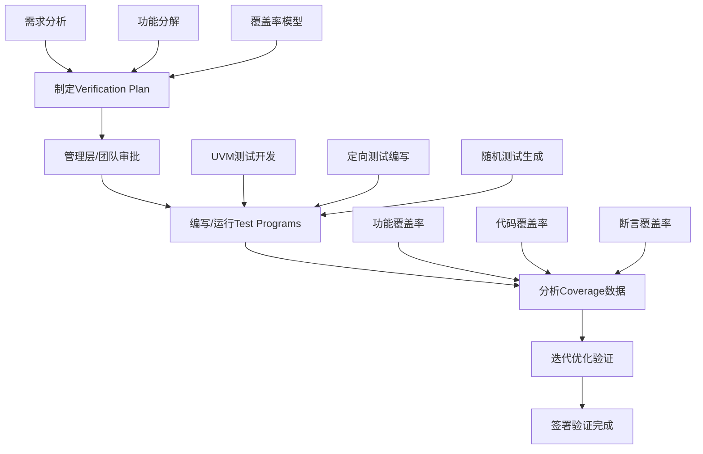

# Verification Plan完全掌握指南

欢迎来到RISC-V验证工程师必备的verification plan深度学习系列！本指南基于CV32E40P项目的成功实践，专为即将开始CVA6核心验证的工程师设计。

## 🎯 为什么Verification Plan是验证工程师最重要的工作

### 验证工程的核心工作流程


**您的理解完全正确！** Verification Plan确实是验证工程师最重要的工作之一。它是：

- 🎯 **项目的北极星** - 定义验证的目标和范围
- 📋 **团队的工作指南** - 指导所有后续的验证活动
- 📊 **管理层的决策依据** - 提供项目进度和质量的量化指标
- 🔄 **质量保证的基础** - 确保验证的完整性和系统性

## 🏗️ CV32E40P验证计划体系架构

基于深度分析，CV32E40P采用了**三层架构**的verification plan管理体系：

### 📊 体系结构概览
```
验证计划体系架构
├── 📋 项目级标准模板
│   ├── CORE-V_Simulation_VerifPlan_Template.xlsx
│   └── CORE-V_Formal_VerifPlan_Template.xlsx
├── 🔄 通用ISA验证计划
│   ├── RV32I基础指令集计划
│   ├── RV32M乘除法扩展计划
│   ├── RV32C压缩指令计划
│   └── 其他标准扩展计划
└── 🎯 核心专用验证计划 (18个Excel文档)
    ├── 中断系统验证计划
    ├── 调试接口验证计划
    ├── 微架构验证计划
    ├── Xpulp扩展指令计划
    └── 专用电路验证计划
```

### 🔄 4阶段状态管理流程
1. **Ready for Review** - 验证计划已制定，等待审查
2. **Reviewed** - 已审查，等待处理反馈意见
3. **Waiting for Signoff** - 反馈已处理，等待最终签署
4. **Complete** - 验证计划已完成并签署

## 📚 学习路径导航

### 🚀 快速上手路径 (1-2周)
适合需要快速开始CVA6验证计划制定的工程师：

1. **[Excel模板深度解析](02-excel-template-deep-dive.md)** 📊
   - 掌握CORE-V Excel模板的使用方法
   - 理解每个字段的含义和填写要求
   - 学习实际的填写技巧和最佳实践

2. **[CV32E40P验证计划实例分析](03-cv32e40p-vplan-analysis.md)** 🔍
   - 分析18个实际Excel文档的内容和结构
   - 理解不同功能模块的验证策略
   - 提取可复用的验证计划模式

3. **[CVA6验证计划制定实战](05-cva6-vplan-development.md)** 🎯
   - 从CV32E40P到CVA6的验证计划适配指南
   - 64位架构验证的特殊考虑
   - 实际的验证计划制定步骤

### 🎓 系统学习路径 (3-4周)
适合希望全面掌握verification plan方法学的工程师：

1. **[验证计划基础概念](01-verification-plan-fundamentals.md)** 📖
   - 验证计划的工程价值和理论基础
   - 验证方法学和最佳实践
   - 与其他验证活动的关系

2. **[Excel模板深度解析](02-excel-template-deep-dive.md)** 📊
   - 详细的模板使用指南
   - 字段定义和填写规范
   - 高级使用技巧

3. **[CV32E40P验证计划深度分析](03-cv32e40p-vplan-analysis.md)** 🔍
   - 完整的验证计划体系剖析
   - 18个Excel文档的详细分析
   - 成功经验和教训总结

4. **[验证计划工作流程管理](04-vplan-workflow-management.md)** 🔄
   - 完整的工作流程和管理实践
   - 团队协作和沟通机制
   - 项目管理和进度追踪

5. **[验证计划审查和追踪](06-vplan-review-and-tracking.md)** ✅
   - GitHub Issue驱动的审查流程
   - PowerPoint presentation的制作和使用
   - 状态管理和质量保证

6. **[CVA6验证计划制定实战](05-cva6-vplan-development.md)** 🎯
   - 综合应用前面学习的知识
   - 完整的CVA6验证计划制定指导

### 🔧 专项技能提升 (按需学习)
针对特定技能需求的专项学习：

- **Excel高级技巧** - 模板定制和自动化
- **Review流程优化** - 提高审查效率和质量
- **覆盖率模型设计** - 功能覆盖率的系统设计
- **团队协作实践** - 大型验证项目的协作管理

## 🛠️ 实用资源和工具

### 📋 模板和检查清单
- **[Excel模板详解](templates/)** - 模板使用指南和定制方法
- **[验证计划质量检查清单](checklists/)** - 确保计划质量的检查要点
- **[审查准备检查清单](checklists/)** - 高效review的准备工作

### 📊 实际案例和示例
- **[CV32E40P验证计划实例](examples/)** - 18个实际Excel文档的解析
- **[CVA6验证计划模板](examples/)** - 基于CV32E40P经验的CVA6模板
- **[最佳实践案例集](examples/)** - 成功项目的经验总结

### 🔄 工作流程和SOP
- **[标准工作流程图](workflows/)** - 完整的verification plan生命周期
- **[审查流程SOP](workflows/)** - 标准化的审查操作程序
- **[状态管理流程](workflows/)** - 4阶段状态管理的具体实施

## 💡 学习建议和技巧

### 🎯 高效学习策略
1. **理论与实践结合** - 边学习概念边操作Excel模板
2. **案例驱动学习** - 重点分析CV32E40P的成功案例
3. **项目导向应用** - 以CVA6项目需求为目标进行学习
4. **团队协作学习** - 与同事一起学习审查流程

### 🚀 快速上手技巧
1. **从模板开始** - 先熟悉Excel模板，再学习理论
2. **重点关注差异** - 重点理解CVA6与CV32E40P的差异
3. **积极参与审查** - 主动参与或观察verification plan审查会议
4. **建立个人模板库** - 基于学习建立自己的模板和检查清单

### 📈 进阶发展建议
1. **成为审查专家** - 掌握高质量verification plan审查的技巧
2. **建立方法学** - 基于项目经验总结自己的验证计划方法学
3. **工具和自动化** - 探索verification plan的工具化和自动化
4. **知识传承** - 将经验传授给团队新成员

## 🎯 针对CVA6项目的特殊价值

### 🔄 从CV32E40P到CVA6的关键转换
- **架构升级** - 32位到64位的验证计划适配
- **功能扩展** - 新增功能的验证计划制定
- **复用优化** - 最大化复用CV32E40P的成功经验
- **团队协作** - 高效的跨团队验证计划协作

### 📊 预期学习成果
通过完整学习本系列，您将能够：

✅ **深度理解verification plan的工程价值和核心地位**
✅ **熟练使用CORE-V Excel模板制定高质量验证计划**
✅ **掌握完整的verification plan工作流程和管理实践**
✅ **成功为CVA6项目制定comprehensive的验证计划**
✅ **建立标准化的团队协作和review机制**
✅ **具备verification plan专家级的审查和指导能力**

## 🚀 开始您的Verification Plan专家之旅

选择适合您需求的学习路径，开始深入掌握这个验证工程师最重要的核心技能。记住，**优秀的verification plan是成功验证项目的基石**！

---

**💡 提示：建议先阅读 [Excel模板深度解析](02-excel-template-deep-dive.md) 或 [验证计划基础概念](01-verification-plan-fundamentals.md)，选择最适合您当前需求的起点。**